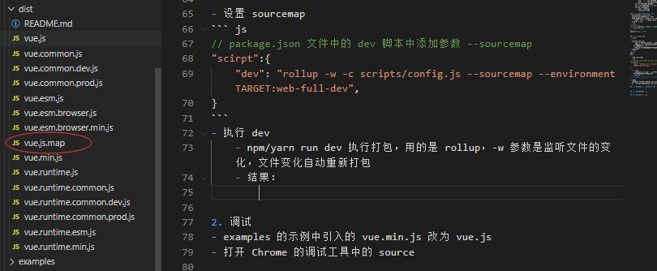
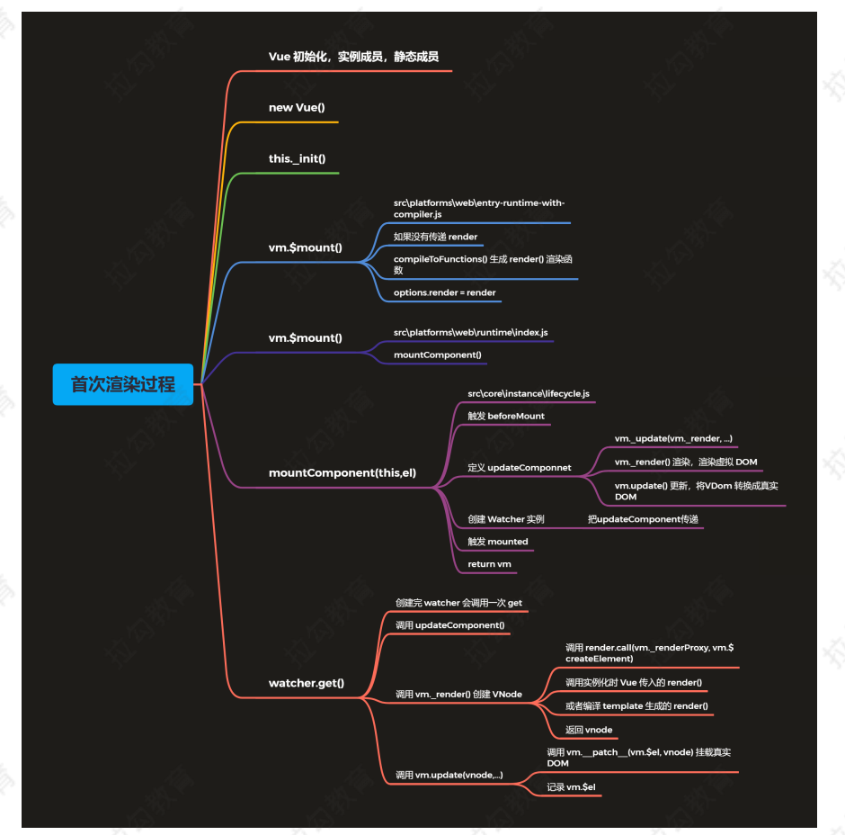
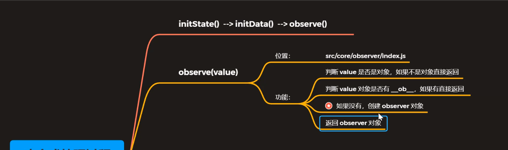
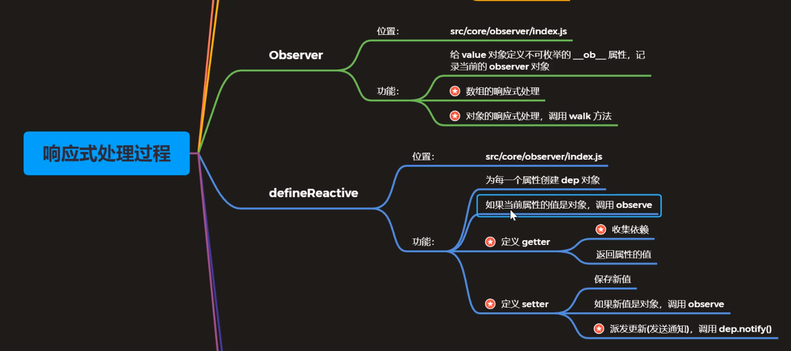
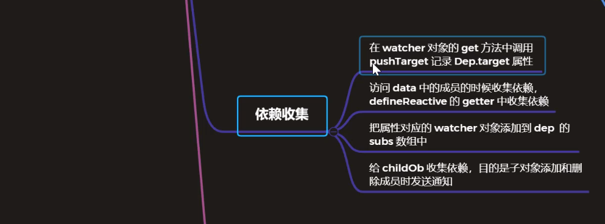
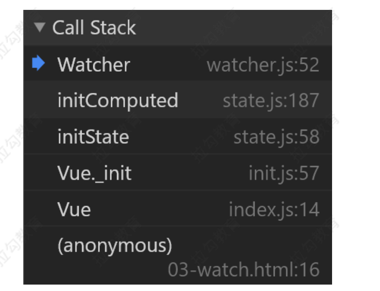
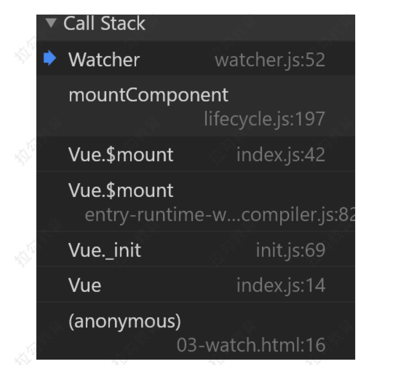

# 1. vue 源码剖析

## 1.1 准备工作

### 1.1.1 Vue 源码的获取

- 项目地址：https://github.com/vuejs/vue
- Fork 一份到自己仓库，克隆到本地，可以自己写注释提交到 github
- 为什么分析 Vue 2.6
    - 到目前为止 Vue 3.0 的正式版还没有发布
    - 新版本发布后，现有项目不会升级到 3.0，2.x 还有很长的一段过渡期
- 3.0 项目地址：https://github.com/vuejs/vue-next

### 1.1.2 源码目录结构
- src
    - compiler 编译相关    作用: 把我们的模板转换成render函数，render函数会帮我们创建虚拟dom         (重点****)
    - core Vue 核心库
        - components 定义了组件
            - keep-alive 组件
        - global-api    定义了一些静态方法
            - use
            - mixin
            - extend    
            - ..... 
        - instance  用来创建 vue 的实例
        - observer   响应式实现的机制            (重点****)
        - vdom      虚拟节点                    (重点****)
            - 相比于 snabbdom 添加了组件的机制     (后续来看)
    - platforms 平台相关代码
        - web   基于 vue 的web端开发框架
        - weex  基于 vue 的移动端开发框架
    - server SSR，服务端渲染
    - sfc .vue 文件编译为 js 对象       (将单文件vue组件转换成js对象)  也不需要编辑器的
    - shared 公共的代码
        - util  公共方法
        - constants 常量

### 1.1.3 了解 Flow 语法检查器
- 官网：https://flow.org/
- JavaScript 的静态类型检查器
- Flow 的静态类型检查错误是通过静态类型推断实现的
    - 文件开头通过 // @flow 或者 /* @flow */ 
- vue3.0 使用ts
``` js
/* @flow */
function square(n: number): number {
    return n * n;
}
square("2"); // Erro
```

### 1.1.4 调试设置
1. 打包

- 打包工具 Rollup
    - Vue.js 源码的打包工具使用的是 Rollup，比 Webpack 轻量
    - Webpack 把所有文件当做模块，Rollup 只处理 js 文件更适合在 Vue.js 这样的库中使用
    - Rollup 打包不会生成冗余的代码
- 安装依赖  
``` js
npm i       
yarn 
```
- 设置 sourcemap
``` js
// package.json 文件中的 dev 脚本中添加参数 --sourcemap
"scirpt":{
    "dev": "rollup -w -c scripts/config.js --sourcemap --environment TARGET:web-full-dev",
}
```
- 执行 dev
    - npm/yarn run dev 执行打包，用的是 rollup，-w 参数是监听文件的变化，文件变化自动重新打包
    - 结果：
        

2. 调试
- examples 的示例中引入的 vue.min.js 改为 vue.js
- 打开 Chrome 的调试工具中的 source，会多一个src文件，src文件里面就是vue的源码文件，并不是打包之后的dist文件。
    
    

### 1.1.5 Vue的不同构建版本
- npm run build 重新打包所有版本vue文件
- [官方文档 - 对不同构建版本的解释](https://cn.vuejs.org/v2/guide/installation.html#%E5%AF%B9%E4%B8%8D%E5%90%8C%E6%9E%84%E5%BB%BA%E7%89%88%E6%9C%AC%E7%9A%84%E8%A7%A3%E9%87%8A)
- dist\README.md

|  | UMD | CommonJS | ES Module |
| :-----| ----: | :----: | :----: |
| Full | vue.js | vue.common.js | vue.esm.js |
| Runtime-only | vue.runtime.js | vue.runtime.common.js |  vue.runtime.esm.js |
| Full (production) | vue.min.js |
| Runtime-only (production) | vue.runtime.min.js | 

术语
- 完整版：同时包含编译器和运行时的版本。        (Full)
- 编译器：用来将模板字符串编译成为 JavaScript 渲染函数的代码，(体积大、效率低)。
    - 创建 vue 实例时我们传入 template 模板，编译器的功能就是将 template 转换成 js 渲染函数，也就是 render函数，render 函数的作用就是生成虚拟dom的

- 运行时：用来创建 Vue 实例、渲染并处理虚拟 DOM 等的代码，(体积小、效率高)。基本上就是除去编译器的代码。  (Runtime-only)
    - 不包含编译器，光编译器的源代码就有3000多行，所以体积小，效率高。
- [UMD](https://github.com/umdjs/umd)：UMD 版本通用的模块版本，支持多种模块方式。 vue.js 默认文件就是运行时 + 编译器的UMD 版本
- [CommonJS](http://wiki.commonjs.org/wiki/Modules/1.1)(cjs)：CommonJS 版本用来配合老的打包工具比如 [Browserify](http://browserify.org/) 或 [webpack 1](https://webpack.github.io/)。
- [ES Module](http://exploringjs.com/es6/ch_modules.html)：从 2.6 开始 Vue 会提供两个 ES Modules (ESM) 构建文件，为现代打包工具提供的版本。
    - ESM 格式被设计为可以被静态分析，所以打包工具可以利用这一点来进行“tree-shaking”并将用不到的代码排除出最终的包。
    - [ES6 模块与 CommonJS 模块的](https://es6.ruanyifeng.com/#docs\module-loader#ES6-%E6%A8%A1%E5%9D%97%E4%B8%8E-CommonJS-%E6%A8%A1%E5%9D%97%E7%9A%84%E5%B7%AE%E5%BC%82)

完整版(Runtime + Compiler) vs. 运行版(Runtime-only)
``` html
<!-- examples/01-start -->
 <!-- 1. 完整版包含编辑器  -->
<!-- <script src="../../dist/vue.js"></script> -->
<!-- 2. 运行版不包含编辑器 -->
<script src="../../dist/vue.runtime.js"></script>
<div id="app"></div>

<script>
    // template 需要 编辑器 才能运行
    // const vm = new Vue({
    //     el: '#app',
    //     template: '<h1>{{ msg }}</h1>',
    //     data: {
    //         msg: 'Hello Vue'
    //     }
    // })

    //  Runtime
    //  render方法不需要编译器
    const vm = new Vue({
        el: '#app',
        render(h) {
            return h('h1', this.msg)
        },
        data: {
            msg: 'Hello Vue'
        }
    })
</script>
```

- 推荐使用运行时版本，因为运行时版本相比完整版体积要小大约 30%
- 基于 Vue-CLI 创建的项目默认使用的是 vue.runtime.esm.js（运行时版的vue），也就是es6的模块化方式
    - 通过查看 webpack 的配置文件
``` js
vue inspect > output.js
```
- 注意： *.vue 文件中的模板是在构建时预编译的，最终打包后的结果不需要编译器，只需要运行时版本即可       (单文件组件不需要编辑器)


## 1.2 寻找入口文件
- 查看 dist/vue.js 的构建过程

执行构建
``` js
// 1. 通过 npm run dev 中的配置找到 dev 的配置文件是在 script/config.js 中 
// npm run dev
"dev": "rollup -w -c scripts/config.js --sourcemap --environment TARGET:web-full-dev"

// --environment TARGET:web-full-dev    (web-完整版的vue-开发版)
// 设置环境变量 TARGET
```
- script/config.js 的执行过程
    - 作用：生成 rollup 构建的配置文件
    - 使用环境变量 TARGET = web-full-dev
``` js
// 2. 在 config.js 文件导出对应 rollup 配置文件
// 判断环境变量是否有 TARGET
// 如果有的话 使用 genConfig() 生成 rollup 配置文件
if (process.env.TARGET) {
    module.exports = genConfig(process.env.TARGET)
} else {
    // 否则获取全部配置
    exports.getBuild = genConfig
    exports.getAllBuilds = () => Object.keys(builds).map(genConfig)
}
```
- genConfig(name)
    - 根据环境变量 TARGET 获取配置信息
    - builds[name] 获取生成配置的信息   
``` js
// 3. 在 genConfig 方法中 通过builds[name] 获取对应的配置信息
// Runtime+compiler development build (Browser)
// web端-完整版vue-开发环境的配置
'web-full-dev': {
    entry: resolve('web/entry-runtime-with-compiler.js'),   // 入口
    dest: resolve('dist/vue.js'),   // 出口
    format: 'umd',      // 模块化的方式
    env: 'development', // 打包方式   development 开发模式  production 生产模式
    alias: { he: './entity-decoder' },  // 别名
    banner    // 文件头
},
```
- resolve()
    - 获取入口和出口文件的绝对路径
``` js
// 4. 通过 resolve 获取文件的绝对路劲
// 通过别名获取文件的绝对路劲
const aliases = require('./alias')
// p: web/entry-runtime-with-compiler.js
const resolve = p => {
  // 根据路劲中的前半部分去alias中找别名
  // web: resolve('src/platforms/web')
  const base = p.split('/')[0]
  if (aliases[base]) {
    return path.resolve(aliases[base], p.slice(base.length + 1))
  } else {
    return path.resolve(__dirname, '../', p)
  }
}

// 5. alias.js
const path = require('path')
const resolve = p => path.resolve(__dirname, '../', p)
module.exports = {
  vue: resolve('src/platforms/web/entry-runtime-with-compiler'),
  compiler: resolve('src/compiler'),
  core: resolve('src/core'),
  shared: resolve('src/shared'),
  web: resolve('src/platforms/web'),
  weex: resolve('src/platforms/weex'),
  server: resolve('src/server'),
  sfc: resolve('src/sfc')
}
```

最终结果:
- 把 src/platforms/web/entry-runtime-with-compiler.js 构建成 dist/vue.js，如果设置 --sourcemap 会生成 vue.js.map
- src/platform 文件夹下是 Vue 可以构建成不同平台下使用的库，目前有 weex 和 web，还有服务器端渲染的库

## 1.3 从入口开始
- src/platform/web/entry-runtime-with-compiler.js

### 1.3.1 通过查看源码解决下面问题
- 观察以下代码，通过阅读源码，回答在页面上输出的结果
``` js
// 同时拥有 template 和 render 会先执行谁，通过查看源码来解决问题
const vm = new Vue({
    el: '#app',
    template: '<h3>Hello template</h3>',
    render (h) {
        return h('h4', 'Hello render')
    }
})
```
- 阅读源码记录
    - el 不能是 body 或者 html 标签
    - 如果没有 render，把 template 转换成 render 函数
    - 如果有 render 方法，直接调用 mount 挂载 DOM
``` js
// 保留 Vue 实例的 $mount 方法
const mount = Vue.prototype.$mount
Vue.prototype.$mount = function (
  el?: string | Element,
  // 非ssr情况下为 false，ssr 时候为true
  hydrating?: boolean
): Component {
    // 获取 el 对象
    el = el && query(el)
    // 1. el 不能是 body 或者 html
    if (el === document.body || el === document.documentElement) {
        // 开发环境报一个警告
        process.env.NODE_ENV !== 'production' && warn(
            `Do not mount Vue to <html> or <body> - mount to normal elements instead.`
        )
        // 返回vue当前实例
        return this
    }
    const options = this.$options
    // 2. 没有 render 函数 把 template/el 转换成 render 函数
    if (!options.render) {
        // .....
    }
    // 3. 调用 mount 方法，挂载 DOM
    return mount.call(this, el, hydrating)
}


```
通过上述源码阅读有个疑问就是: $mount 方法是在哪里被调用的？
- 调试代码          examples/02-debug
    - 调试的方法
``` js
const vm = new Vue({
    el: '#app',
    template: '<h3>Hello template</h3>',
    render (h) {
    return h('h4', 'Hello render')
    }
})
```
 


通过上述调试我们知道了 $mount 是在 Vue 的构造函数中执行的 Vue._init方法中执行的。 

> Vue 的构造函数在哪？
> Vue 实例的成员/Vue 的静态成员从哪里来的？


### 1.3.2  Vue 的构造函数在哪里
- src/platform/web/entry-runtime-with-compiler.js 中引用了  './runtime/index'
- src/platform/web/runtime/index.js            
    - 设置 Vue.config
    - 设置平台相关的指令和组件
        - 指令 v-model、v-show  
        - 组件 transition、transition-group
    - 设置平台相关的 __patch__ 方法（打补丁方法，对比新旧的 VNode）
    - 给 Vue 的原型上 设置 $mount 方法，挂载 DOM
    - 跟平台相关的代码，在这里没有看到 Vue 构造函数
``` js
// src/platform/web/runtime/index.js 
// 跟平台相关的代码，在这里没有看到 Vue 构造函数

// install platform specific utils
// 1. 判断是否是关键属性(表单元素的 input/checked/selected/muted)
// 如果是这些属性，设置el.props属性(属性不设置到标签上)
Vue.config.mustUseProp = mustUseProp
Vue.config.isReservedTag = isReservedTag
Vue.config.isReservedAttr = isReservedAttr
Vue.config.getTagNamespace = getTagNamespace
Vue.config.isUnknownElement = isUnknownElement

// install platform runtime directives & components
// 2. 注册全局的指令和组件
extend(Vue.options.directives, platformDirectives)
extend(Vue.options.components, platformComponents)


// install platform patch function
// 3. 设置平台相关的 __patch__ 方法（打补丁方法，对比新旧的 VNode）
Vue.prototype.__patch__ = inBrowser ? patch : noop

// public mount method
// 4. 给 Vue 的原型上 设置 $mount 方法，挂载 DOM
Vue.prototype.$mount = function (
  el?: string | Element,
  hydrating?: boolean
): Component {
  el = el && inBrowser ? query(el) : undefined
  // 渲染dom
  return mountComponent(this, el, hydrating)
}
```
- src/platform/web/runtime/index.js 中引用了  'core/index'
- src/core/index.js
    - 定义了 Vue 的静态方法
    - initGlobalAPI(Vue)    给 Vue 定义了一些静态方法
        - Vue.config 初始化 config属性
        - Vue.util  添加一些公共的方法
- src/core/index.js 中引用了 './instance/index'
- src/core/instance/index.js
    - 定义了 Vue 的构造函数
``` js
// 此处不用 class 的原因是因为方便后续给 Vue 实例混入实例成员
function Vue(options) {
  // 开发环境，不是通过 new 实例化 Vue 报个警告 
  if (process.env.NODE_ENV !== 'production' &&
    !(this instanceof Vue)
  ) {
    warn('Vue is a constructor and should be called with the `new` keyword')
  }
  // 1. 调用 _init()方法
  this._init(options)
}
// 2. 注册 vm 的 _init() 方法，初始化vm
initMixin(Vue)
// 3. 注册 vm 的 $data/$props/$set/$delte/$watch
stateMixin(Vue)
// 4. 初始化事件相关方法
// $on/$once/$off/$emit
eventsMixin(Vue)
// 5. 初始化生命周期相关的混入方法
// _update/$forceUpdate/$destroy
lifecycleMixin(Vue)
// 6. 混入 render
// $nextTick/_render
renderMixin(Vue)
export default Vue
```

### 1.3.3 四个导出 Vue 的模块
通过上述的调试总结：四个导出 Vue 的模块
- src/platforms/web/entry-runtime-with-compiler.js
    - web 平台相关的入口
    - 重写了平台相关的 $mount() 方法
    - 注册了 Vue.compile() 方法，传递一个 HTML 字符串返回 render 函数
- src/platforms/web/runtime/index.js
    - web 平台相关
    - 注册和平台相关的全局指令：v-model、v-show
    - 注册和平台相关的全局组件： v-transition、v-transition-group
    - 全局方法：
        - __patch__：把虚拟 DOM 转换成真实 DOM
        - $mount：挂载方法
- src/core/index.js
    - 与平台无关
    - 设置了 Vue 的静态方法，initGlobalAPI(Vue)     (后续看静态方法***)
- src/core/instance/index.js
    - 与平台无关
    - 定义了构造函数，调用了 this._init(options) 方法
    - 给 Vue 中混入了常用的实例成员  (后续看实例方法***)


## 1.4 Vue 的初始化

### 1.4.1 初始化 Vue 的静态成员

src/core/global-api/index.js

``` js
export function initGlobalAPI(Vue: GlobalAPI) {
  // config
  const configDef = {}
  configDef.get = () => config
  // 不是生产环境调用config的set方法时报一个警告
  if (process.env.NODE_ENV !== 'production') {
    configDef.set = () => {
      // 不要给Vue.config去重新复制，你可以在Vue.config中挂载对应的属性和方法
      warn(
        'Do not replace the Vue.config object, set individual fields instead.'
      )
    }
  }
  // 1. 初始化 Vue.config 对象
  Object.defineProperty(Vue, 'config', configDef)

  // exposed util methods.
  // NOTE: these are not considered part of the public API - avoid relying on
  // them unless you are aware of the risk.
  // 2. 这些工具方法不视作全局API的一部分，除非你已经意识到莫些风险，否则不要去依赖他们
  Vue.util = {
    warn,
    extend,
    mergeOptions,
    defineReactive
  }
  // 3. 静态方法 set/delete/nextTick
  Vue.set = set
  Vue.delete = del
  Vue.nextTick = nextTick

  // 4. 让一个对象可响应
  // 2.6 explicit observable API
   Vue.observable = <T>(obj: T): T => {
    observe(obj)
    return obj
  }
  // 5. 初始化 Vue.options 对象
  // 并给其扩展 components/directives/filters 属性 (全局属性)
  // 功能： 记录使用Vue.component/directive/filter注册的全局component/directive/filter
  Vue.options = Object.create(null)
  // ASSET_TYPES 常量 ['component','directive','filter']
  ASSET_TYPES.forEach(type => {
      Vue.options[type + 's'] = Object.create(null)
    })

  // this is used to identify the "base" constructor to extend all plain-object
  // components with in Weex's multi-instance scenarios.

  // 6. 在 _base 属性中记录 Vue 构造函数
  Vue.options._base = Vue

  // 7. 设置 keep-alive 组件    (注册全局组件)
  // extend 就是一个浅拷贝
  extend(Vue.options.components, builtInComponents)

  // 8. 注册全局方法
  // 8.1 注册 Vue.use() 用来注册插件
  initUse(Vue)
  // 8.2 注册 Vue.mixin() 实现混入 
  initMixin(Vue)
  // 8.3 注册 Vue.extend() 基于传入的options返回一个组件的构造函数
  // 返回 Vue.component 构造函数  他的原型继承自 Vue   (所有的组件都是继承自Vue)
  initExtend(Vue)
  // 8.4 注册 Vue.directive、component、filter 
  initAssetRegisters(Vue)
}
```
- initUse(Vue)
    - 初始化 Vue.use方法        用来注册插件
``` js
/* @flow */

import { toArray } from '../util/index'

export function initUse(Vue: GlobalAPI) {
  Vue.use = function (plugin: Function | Object) {
    // 1. 获取vue安装过的插件数组
    const installedPlugins = (this._installedPlugins || (this._installedPlugins = []))
    // 2. 插件已注册直接返回
    if (installedPlugins.indexOf(plugin) > -1) {
      return this
    }

    // additional parameters
    // 3. 核心功能是：调用插件的方法，然后传递相应的参数，最后当我们把插件注册好之后，追到到插件数组中

    // 3.1 封装参数
    // 把数组中的第一个元素(plugin)去除，返回一个数组
    const args = toArray(arguments, 1)
    // 把this(Vue)插入数组的第一个位置
    args.unshift(this)
    // 3.2 安装插件
    // 如果插件是是对象
    if (typeof plugin.install === 'function') {
      // 3.2.1 直接调用对象的install方法，安装插件
      plugin.install.apply(plugin, args)
    } else if (typeof plugin === 'function') {
      // 3.2.2 如果插件是函数，直接执行这个函数，安装插件
      plugin.apply(null, args)
    }
    // 3.3 把安装好的插件插入的已安装的插件数组中
    installedPlugins.push(plugin)

    // 4. 返回 Vue 这个构造函数
    return this
  }
}
```

- initExtend(Vue)
    - 注册全局的 Vue.extend() 
        -  基于传入的options对象返回一个组件的构造函数
        - 返回 Vue.component 构造函数  他的原型继承自 Vue   (所有的Vue 组件都是继承自Vue)
``` js
/* @flow */

import { ASSET_TYPES } from 'shared/constants'
import { defineComputed, proxy } from '../instance/state'
import { extend, mergeOptions, validateComponentName } from '../util/index'

export function initExtend(Vue: GlobalAPI) {
  /**
   * Each instance constructor, including Vue, has a unique
   * cid. This enables us to create wrapped "child
   * constructors" for prototypal inheritance and cache them.
   */
  Vue.cid = 0
  let cid = 1

  /**
   * Class inheritance
   */
  // extendOptions 组件的选项
  // 功能： 把普通对象转换成 Vue 组件的构造函数
  Vue.extend = function (extendOptions: Object): Function {
    extendOptions = extendOptions || {}
    // Vue 构造函数
    const Super = this
    const SuperId = Super.cid
    // 从缓存中加载组件的构造函数
    const cachedCtors = extendOptions._Ctor || (extendOptions._Ctor = {})
    if (cachedCtors[SuperId]) {
      return cachedCtors[SuperId]
    }

    const name = extendOptions.name || Super.options.name
    if (process.env.NODE_ENV !== 'production' && name) {
      // 如果是开发环境验证组件的名称
      validateComponentName(name)
    }

    // 组件的构造函数
    const Sub = function VueComponent(options) {
      // 调用 _init() 初始化
      this._init(options)
    }
    // 原型继承自 Vue   (所有的组件都是继承自Vue)
    Sub.prototype = Object.create(Super.prototype)
    Sub.prototype.constructor = Sub
    Sub.cid = cid++
    // 合并 options
    Sub.options = mergeOptions(
      Super.options,
      extendOptions
    )
    Sub['super'] = Super

    // For props and computed properties, we define the proxy getters on
    // the Vue instances at extension time, on the extended prototype. This
    // avoids Object.defineProperty calls for each instance created.
    if (Sub.options.props) {
      initProps(Sub)
    }
    if (Sub.options.computed) {
      initComputed(Sub)
    }

    // allow further extension/mixin/plugin usage
    Sub.extend = Super.extend
    Sub.mixin = Super.mixin
    Sub.use = Super.use

    // create asset registers, so extended classes
    // can have their private assets too.
    ASSET_TYPES.forEach(function (type) {
      Sub[type] = Super[type]
    })
    // enable recursive self-lookup
    // 把组件构造函数保存到 Ctor.options.components.comp = Ctor
    if (name) {
      Sub.options.components[name] = Sub
    }

    // keep a reference to the super options at extension time.
    // later at instantiation we can check if Super's options have
    // been updated.
    Sub.superOptions = Super.options
    Sub.extendOptions = extendOptions
    Sub.sealedOptions = extend({}, Sub.options)

    // cache constructor
    // 把组件的构造函数缓存到 options._Ctor
    cachedCtors[SuperId] = Sub
    // 返回的就是 Vue.component 
    return Sub
  }
}

function initProps(Comp) {
  const props = Comp.options.props
  for (const key in props) {
    proxy(Comp.prototype, `_props`, key)
  }
}

function initComputed(Comp) {
  const computed = Comp.options.computed
  for (const key in computed) {
    defineComputed(Comp.prototype, key, computed[key])
  }
}
```

- initAssetRegisters(Vue)
    - 注册全局的 Vue.directive、component、filter 
``` js
/* @flow */

/* @flow */

import { ASSET_TYPES } from 'shared/constants'
import { isPlainObject, validateComponentName } from '../util/index'

export function initAssetRegisters(Vue: GlobalAPI) {
  /**
   * Create asset registration methods.
   */
  // 遍历 ASSET_TYPES 数组，为 Vue 定义相应的方法
  // ASSET_TYPES 包括了 directive,component,filter
  ASSET_TYPES.forEach(type => {
    Vue[type] = function (
      id: string,
      definition: Function | Object
    ): Function | Object | void {
      // 1. 第二个参数没有，就是获取之前定义的directive,component,filter
      if (!definition) {
        return this.options[type + 's'][id]
      } else {
        // 2. 注册全局的directive,component,filter
        /* istanbul ignore if */
        if (process.env.NODE_ENV !== 'production' && type === 'component') {
          validateComponentName(id)
        }

        // 2.1 定义的是组件，
        // 第二个参数是 Vue.extend Vue.component，就不需要处理了，直接返回 
        // 第二个参数是原始的object对象，做如下的处理
        // Vue.component("comp",{template:""})
        // isPlainObject => Object.prototype.toString.call(obj) === '[object Object]'
        if (type === 'component' && isPlainObject(definition)) {
          // 设置组件的名称
          definition.name = definition.name || id
          // 把组件配置(普通对象)转换为组件的构造函数
          definition = this.options._base.extend(definition)
        }

        // 2.3 定义的是指令，
        // 第二个参数是对象，就不需要处理了，直接返回 
        // 第二个参数是函数，会做如下处理
        if (type === 'directive' && typeof definition === 'function') {
          // 把函数设置给bind和update这两个方法
          definition = { bind: definition, update: definition }
        }
        // 3. 全局注册、存储资源并赋值
        // 将定义的directive,component,filter存到options属性中，方便下次拿到
        // this.options["component"]["comp"] = definition
        this.options[type + 's'][id] = definition
        return definition
      }
    }
  })
}
```


### 1.4.2 初始化 Vue 的实例成员
src/core/instance/index.js

- 定义 Vue 的构造函数
- 初始化 Vue 的实例成员
``` js
import { initMixin } from './init'
import { stateMixin } from './state'
import { renderMixin } from './render'
import { eventsMixin } from './events'
import { lifecycleMixin } from './lifecycle'
import { warn } from '../util/index'

// 此处不用 class 的原因是因为方便后续给 Vue 实例混入实例成员
function Vue(options) {
  // 开发环境，不是通过 new 实例化 Vue 报个警告 
  if (process.env.NODE_ENV !== 'production' &&
    !(this instanceof Vue)
  ) {
    warn('Vue is a constructor and should be called with the `new` keyword')
  }
  // 1. 调用 _init()方法
  this._init(options)
}

// 下面这些方法都是给 Vue.property 上注册了一些成员也就是给实例上添加了成员
// 2. 注册 vm 的 _init() 方法，初始化vm
initMixin(Vue)
// 3. 注册 vm 的 $data/$props/$set/$delte/$watch
stateMixin(Vue)
// 4. 初始化事件相关方法    内部使用了发布订阅模式
// $on/$once/$off/$emit
eventsMixin(Vue)
// 5. 初始化生命周期相关的混入方法
// _update/$forceUpdate/$destroy
lifecycleMixin(Vue)
// 6. 混入 render
// $nextTick/_render
renderMixin(Vue)

export default Vue
``` 
总结： 
- stateMixin，eventsMixin，lifecycleMixin，renderMixin的作用
    - 就是给 Vue 的原型上去混入一些成员，就是属性和方法，其实就是给 vue 的对象增加一些实例成员。
- initMixin 注册了 _init 方法


## 1.5 首次渲染的过程
在如下4个文件中打断点调试
- src/core/instance/index.js  
  - 定义了 Vue 的构造函数
    - 在构造函数中调用了 _init(options)方法
    - 这个章节就是调试 _init方法，观察首次渲染的过程
  - 定义了一些 mixin 函数
    - 这些函数，给 Vue 的原型上挂载一些实例方法
- src/core/index.js
  - 调用了 initGlobalAPI(Vue) 
    - 帮我们初始化了 Vue 的静态成员
- src/platforms/web/runtime/index.js  
  - 初始化了更平台相关的内容
  - 挂载了一些指令    model,show
  - 挂载了一些组件      Transition,TransitionGroup
  - 在Vue原型上挂载了 __path__ 和 $mount 方法
    - __path__    （打补丁方法，对比新旧的 VNode） 
    - $moutn      挂载 DOM
- src/platforms/entry-runtime-with-compiler.js
  - 重写了上一个文件 $mount 方法
    - 在 $moutn 方法中我们添加了编译的功能，把模板编译成 render 函数


调试 Vue 首次渲染的过程 在 __init__ 方法打断点， (src/core/instance/index.js)


  

- Vue 初始化，实例成员(src/core/instance/index.js)，静态成员(src/core/index.js)
- new Vue构造函数，在构造函数中调用了 _init 方法   (src/core/instance/index.js)
- this._init 做首次渲染的过程 (src\core\instance\init.js)
- 判断当前实例是不是 Vue 实例，如果是 Vue 实例不进行响应式处理
- 合并options 
  - 判断当前实例是不是 component 组件
    - 是组件就合并用户传入的 options 和 Component 组件的 options
    - 不是组件合并用户传入的 option 和 Vue 构造函数的options 
- 设置 _renderProxy (渲染时的代理对象)
  - 开发环境执行 _initProxy(vm) 
    - 判断浏览器是否支持 Proxy
      - 支持：  设置 _initProxy 等于 new Proxy(vm,handlers)，通过 Proxy 代理 vm 实例
      - 不支持：直接把 vm 实例 设置给 _initProxy
  - 生产环境，直接把 vm 实例设置给 _renderProxy
- 执行一些 init 函数给 Vue 实例挂载一些成员
- 调用 $mount 方法    (src\platforms\web\entry-runtime-with-compiler.js)
  - 获取实例的 option 选项
  - 判断 options 选项中是否有 render 函数
    - 如果没有 render 会获取选项的 template
      - 判断 template 是否存在
        - 存在 template:
          - 是否是字符串
            - 是否有 # 就认为是 id 选择器，把 id 选择器的 innerHTML 作为 template 返回
          - 是否有 nodeType 这个属性，有就是一个 dom 元素，把 dom 的 innerHTML 作为template返回
          - 不是字符串也不是 dom 元素
            - 开发环境会发出一个警告，当前 template 不合法，并且返回当前实例
            - 生产环境直接返回当前实例
        - 不存在 template:
          - 判断是否有 el 
            - 判断 el 是不是 dom 元素
              - 是的话直接返回
              - 不是的话，会帮我们创建一个 div 节点，然后把 el 克隆一份追加到 div 节点中来，最终把 div 的 innerHTML 返回作为 template
          


    - 有了 template , 现在开始帮我们编译了
      - 调用 compileToFunctions 帮我们把 template 编译成 render 函数 
        - 把编译好的 render 函数存到 options 中
- 最后有了 render 函数之后，执行 mount 函数  (src\platforms\web\runtime\index.js)    
  - 会重新获取 el 
    - 因为运行时版本不会执行上面的src\platforms\web\entry-runtime-with-compiler.js 文件获取el，所以要重新获取一遍el 
  - 调用 mountComponent (跟浏览器无关的代码)
   - 判断是否有 render 函数
    - 无 render
      - 是开发环境，运行时环境，并且通过选项传入了 template，会发出一个警告
        - 警告：当前运行的是运行时版本，compiler 是无效的，不能编译 template 模板
   - 调用 callHook 触发了 beforeMount 钩子函数
   - 定义了 updateComponent 函数，更新组件，就是挂载
      - 判断是否是开发环境，启动了性能监测了话，会执行一些监测的代码
      - 调用了 _render 方法
        - 调用用户传入的 render 获取编译器生成的 render , 他最终会返回 vnode,把 vnode 传给 _update 方法,在 _update 方法中就会把 vnode 转换成真实 dom,最后更新到界面上
   - 创建了 Watcher 对象，把 updateComponet 函数传递进来了，updateComponent 在 Watcher 对象中执行的   (src\core\observer\watcher.js)
      - vm: vue 实例
      - expOrFn:  可以是字符串或者fn
        - 字符串      (计算属性的watcher,监听器的watcher)
        - function  update 更新函数 (渲染watcher)
      - cb  
      - options
        - lazy 延迟执行 
            - 计算属性的watcher延迟执行
      - isRenderWatcher 是否是渲染 watcher
      - 给this.getter赋值 判断 expOrFn 是否是函数
        - 是函数  直接把 expOrFn 赋值给 this.getter
        - 是字符串  需要进一步处理
      - 给this.value 赋值
        - 是否是lazy
          - 是  赋值 undefind
          - 否  赋值 this.get()
      - get 方法中
        - 把 watcher push 到 Target 中
        - 调用了 this.getter 方法，也就是调用了 expOrFn 渲染视图
   - 在 mountComponet 调用 callHook 触发了 mounted 钩子函数


## 1.6 数据响应式原理
数据响应式指的是当数据发生变化时候自动更新视图，不需要我们手动操作dom。
### 1.6.1 通过查看源码解决下面问题
- vm.msg = { count: 0 } ，重新给属性赋值，是否是响应式的？
  - 不是响应式的
- vm.arr[0] = 4 ，给数组元素赋值，视图是否会更新
  - 不会更新
- vm.arr.length = 0 ，修改数组的 length，视图是否会更新
  - 不会更新
- vm.arr.push(4) ，视图是否会更新
  - 会更新，Vue 修补了数组的 pop,push,reverse,shift,sort,splice,unshift方法，调用这些方法的时候会发送通知修改数据

### 1.6.2 响应式处理的入口    src\core\observer\index.js
整个响应式处理的过程是比较复杂的，下面我们先从
- src\core\instance\init.js
  - initState(vm) vm 状态的初始化
  - 初始化了 _data、_props、methods 等
- src\core\instance\state.js
``` js
// 数据的初始化
if (opts.data) {
  initData(vm)  // initData 方法把 options的data注入到vue中，并且在内部调用observe 把它转换成响应式对象
} else {
  observe(vm._data = {}, true /* asRootData */)   // observe 就是响应式处理的入口
} 
```
- initData(vm)  vm 数据的初始化
``` js
function initData(vm: Component) {
  let data = vm.$options.data
  // 初始化 _data，组件中 data 是函数，调用函数返回结果
  // 否则返回 data
  data = vm._data = typeof data === 'function'
    ? getData(data, vm)
    : data || {}
  if (!isPlainObject(data)) {
    data = {}
    process.env.NODE_ENV !== 'production' && warn(
      'data functions should return an object:\n' +
      'https://vuejs.org/v2/guide/components.html#data-Must-Be-a-Function',
      vm
    )
  }
  // proxy data on instance
  // 获取 data 中的所有属性
  const keys = Object.keys(data)
  // 获取 props / methods 
  const props = vm.$options.props
  const methods = vm.$options.methods
  let i = keys.length
  // 判断 data 上的成员是否和 props/methods 重命
  while (i--) {
    const key = keys[i]
    // 如果重命在开发环境中发送一个警告
    if (process.env.NODE_ENV !== 'production') {
      if (methods && hasOwn(methods, key)) {
        warn(
          `Method "${key}" has already been defined as a data property.`,
          vm
        )
      }
    }
    if (props && hasOwn(props, key)) {
      process.env.NODE_ENV !== 'production' && warn(
        `The data property "${key}" is already declared as a prop. ` +
        `Use prop default value instead.`,
        vm
      )
    } else if (!isReserved(key)) {
      // 把 data 中的成员注入到 vue 实例
      proxy(vm, `_data`, key)
    }
  }
  // observe data
  // 响应式处理
  observe(data, true /* asRootData */)
}
```

- src\core\observer\index.js  (响应式处理的入口)
  - observe(value, asRootData) 
  - 负责为每一个 Object 类型的 value 创建一个 observer 实例

``` js
export function observe (value: any, asRootData: ?boolean): Observer | void {
  // 判断 value 是否是对象
  // 不是对象就不要做处理 
  if (!isObject(value) || value instanceof VNode) {
    return
  }
  let ob: Observer | void
  // 判断 value 是否有 __ob__(observer对象)  相当于加了一个缓存
  if (hasOwn(value, '__ob__') && value.__ob__ instanceof Observer) {
    // 有 observer 对象直接返回
    ob = value.__ob__
  } else if (
    // 没有就创建 observer 对象返回
    
    // 判断对象是否可以做响应式处理
    shouldObserve &&
    !isServerRendering() &&
    (Array.isArray(value) || isPlainObject(value)) &&
    Object.isExtensible(value) &&
    !value._isVue
  ) {
    // 创建一个 Observer 对象
    ob = new Observer(value)
  }
  // 是根数据，vmCount计数++
  if (asRootData && ob) {
    ob.vmCount++
  }
  return ob
}
```

### 1.6.3 Observer
- src\core\observer\index.js
  - 对对象做响应化处理
  - 对数组做响应化处理
``` js
export class Observer {
  // 观察对象
  value: any;
  // 依赖对象  
  dep: Dep;
  // 实例计数器
  vmCount: number; // number of vms that have this object as root $data

  constructor(value: any) {
    this.value = value
    this.dep = new Dep()
    // 初始化实例的 vmCount 为0
    this.vmCount = 0
    // 将实例挂载对象观察对象的 __obj__ 胡思性
    def(value, '__ob__', this)
    // 数组的响应式处理
    if (Array.isArray(value)) {
      if (hasProto) {
        protoAugment(value, arrayMethods)
      } else {
        copyAugment(value, arrayMethods, arrayKeys)
      }
      // 为数组中的每一个对象创建 observer 实例
      this.observeArray(value)
    } else {
      // 遍历对象中的每一个属性，转换成 setter/getter
      this.walk(value)
    }
  }

  /**
   * Walk through all properties and convert them into
   * getter/setters. This method should only be called when
   * value type is Object.
   */
  walk(obj: Object) {
    // 获取观察对象的每一个属性
    const keys = Object.keys(obj)
    // 遍历每一个属性，设置为响应式数据
    for (let i = 0; i < keys.length; i++) {
      // 把对象的属性转换成 getter/setter 
      defineReactive(obj, keys[i])
    }
  }

  /**
   * Observe a list of Array items.
   */
  // 对数组做响应式处理
  observeArray(items: Array<any>) {
    for (let i = 0, l = items.length; i < l; i++) {
      observe(items[i])
    }
  }
}
```
- walk(obj) 
  - 遍历 obj 的所有属性，为每一个属性调用 defineReactive() 方法，设置 getter/setter

总结：Observer 类的作用
- Observer 类会附加到每个观察的对象
- 一旦附加，observer 这个对象就会转换目标对象的所有属性
- 把所有属性转换成 getter/setter
- getter/setter 的目的是收集依赖(创建watcher)和派发更新(dep.notify发送通知)


### 1.6.4 defineReactive
- src\core\observer\index.js
- defineReactive(obj, key, val, customSetter, shallow)
  - 为一个对象定义一个响应式的属性，每一个属性对应一个 dep 对象
  - 如果该属性的值是对象，继续调用 observe
  - 如果给属性赋新值，继续调用 observe
  - 如果数据更新发送通知

对象响应式处理
``` js
// 为一个对象定义一个响应式的属性
export function defineReactive(
  obj: Object,
  key: string,
  val: any,
  customSetter?: ?Function,
  // true 浅度监听，false 深度监听
  shallow?: boolean
) {
  // 创建依赖对象实例
  const dep = new Dep()
  // 获取 obj 的属性描述符
  const property = Object.getOwnPropertyDescriptor(obj, key)
  // 当前属性不可配置，直接返回
  if (property && property.configurable === false) {
    return
  }
  // 提供预定义的存取器函数
  // 这个 getter/setter 可能是用户传入的
  // 把用户传入的先取出来，取起来 
  // cater for pre-defined getter/setters
  const getter = property && property.get
  const setter = property && property.set
  if ((!getter || setter) && arguments.length === 2) {
    // 获取 val 值
    val = obj[key]
  }

  // 判断是否递归观察子对象，并将子对象属性都转换成 getter/setter，返回子观察对象
  let childOb = !shallow && observe(val)
  Object.defineProperty(obj, key, {
    enumerable: true,
    configurable: true,
    get: function reactiveGetter() {
      // 如果预定义的 getter 存在则 value 等于 getter 返回的结果
      // 否则直接赋予属性值
      const value = getter ? getter.call(obj) : val
      // 如果存在当前依赖目标，即 watcher 对象，则建立依赖
      if (Dep.target) {
        // dep() 添加相互的依赖
        // 1个组件对应一个 watcher 对象
        // 1个watcher会对应多个dep（要观察的属性很多）
        // 我们可以手动创建多个 watcher 监听1个属性的变化，1个dep可以对应多个watcher
        dep.depend()
        // 如果子观察目标存在，建立子对象的依赖关系，将来 Vue.set() 会用到
        if (childOb) {
          childOb.dep.depend()
          // 如果属性是数组，则特殊处理收集数组对象依赖
          if (Array.isArray(value)) {
            dependArray(value)
          }
        }
      }
      // 返回属性值
      return value
    },
    set: function reactiveSetter(newVal) {
      // 如果预定义的 getter 存在则 value 等于 getter 返回的结果
      // 否则直接赋予属性值
      const value = getter ? getter.call(obj) : val
      // 如果新值等于旧值或者新值为NaN则不执行
      /* eslint-disable no-self-compare */
      if (newVal === value || (newVal !== newVal && value !== value)) {
        return
      }
      /* eslint-enable no-self-compare */
      if (process.env.NODE_ENV !== 'production' && customSetter) {
        customSetter()
      }
      // 如果预定义的 setter 存在则 调用 setter 方法给这个属性去赋值 
      // 否则直接把新值赋值给这个属性
      // #7981: for accessor properties without setter
      if (getter && !setter) return
      if (setter) {
        setter.call(obj, newVal)
      } else {
        val = newVal
      }
      // 如果新值是对象，观察子对象并返回子的 observer 对象
      childOb = !shallow && observe(newVal)
      // 派发更新(发布更改通知)
      dep.notify()
    }
  })
}
```

数组响应式原理
- Observer 的构造函数中
``` js
// 数组的响应式处理
if (Array.isArray(value)) {
   // 浏览器是否支持对象的 prototype 属性 
  if (hasProto) {
    protoAugment(value, arrayMethods)
  } else {
    copyAugment(value, arrayMethods, arrayKeys)
  }
    // 为数组中的每一个对象创建一个 observer 实例
    this.observeArray(value)
  } else {
    // 编译对象中的每一个属性，转换成 setter/getter
    this.walk(value)
}
function protoAugment (target, src: Object) {
  /* eslint-disable no-proto */
  target.__proto__ = src
  /* eslint-enable no-proto */
}
/* istanbul ignore next */
function copyAugment (target: Object, src: Object, keys: Array<string>) {
    for (let i = 0, l = keys.length; i < l; i++) {
      const key = keys[i]
      def(target, key, src[key])
    }
}
```
- 处理数组修改数据的方法
  - src\core\observer\array.js
``` js
import { def } from '../util/index'

const arrayProto = Array.prototype
// 克隆数组的原型
export const arrayMethods = Object.create(arrayProto)

// 修改数组的元素的方法
const methodsToPatch = [
  'push',
  'pop',
  'shift',
  'unshift',
  'splice',
  'sort',
  'reverse'
]

/**
 * Intercept mutating methods and emit events
 */
methodsToPatch.forEach(function (method) {
  // cache original method
  // 保存数组原方法
  const original = arrayProto[method]
  // 调用 Object.defineProperty() 重新定义修改数组的方法
  def(arrayMethods, method, function mutator(...args) {
    // 执行数组的原始方法
    const result = original.apply(this, args)
    // 获取数组对象的 ob 对象
    const ob = this.__ob__
    let inserted
    switch (method) {
      case 'push':
      case 'unshift':
        inserted = args
        break
      case 'splice':
        inserted = args.slice(2)
        break
    }
    // 对插入的新元素，重新遍历数组元素设置为响应式数据
    if (inserted) ob.observeArray(inserted)
    // notify change
    // 调用了修改数组的方法，调用数组的ob对象发送通知
    ob.dep.notify()
    return result
  })
})
```

### 1.6.5 Dep 类
- 在 defineReactive 的 getter 方法中收集依赖
``` js
get: function reactiveGetter() {
    // 如果预定义的 getter 存在则 value 等于 getter 返回的结果
    // 否则直接赋予属性值
    const value = getter ? getter.call(obj) : val
    // 如果存在当前依赖目标，即 watcher 对象，则建立依赖
    if (Dep.target) {
      // dep() 添加相互的依赖
      // 1个组件对应一个 watcher 对象
      // 1个watcher会对应多个dep（要观察的属性很多）
      // 我们可以手动创建多个 watcher 监听1个属性的变化，1个dep可以对应多个watcher
      dep.depend()
      // 如果子观察目标存在，建立子对象的依赖关系，将来 Vue.set() 会用到
      if (childOb) {
        // 在 $set,$delete中用
        childOb.dep.depend()
        // 如果属性是数组，则特殊处理收集数组对象依赖
        if (Array.isArray(value)) {
          dependArray(value)
        }
      }
    }
    // 返回属性值
    return value
  },
```

- src\core\observer\dep.js
- 依赖对象
- 记录 watcher 对象
- depend() -- watcher 记录对应的 dep
- 发布通知

> 1. 在 defineReactive() 的 getter 中创建 dep 对象，并判断 Dep.target 是否有值（一会再来看有什么时候有值得）, 调用 dep.depend()
> 2. dep.depend() 内部调用 Dep.target.addDep(this)，也就是 watcher 的 addDep() 方法，它内部最调用 dep.addSub(this)，把 watcher 对象，添加到 dep.subs.push(watcher) 中，也就是把订阅者添加到 dep 的 subs 数组中，当数据变化的时候调用 watcher 对象的 update() 方法
> 3. 什么时候设置的 Dep.target? 通过简单的案例调试观察。调用 mountComponent() 方法的时候，创建了渲染 watcher 对象，执行 watcher 中的 get() 方法
> 4. get() 方法内部调用 pushTarget(this)，把当前 Dep.target = watcher，同时把当前watcher 入栈，因为有父子组件嵌套的时候先把父组件对应的 watcher 入栈，再去处理子组件的 watcher，子组件的处理完毕后，再把父组件对应的 watcher 出栈，继续操作
>5. Dep.target 用来存放目前正在使用的watcher。全局唯一，并且一次也只能有一个 watcher被使用
``` js
let uid = 0
// dep 是个可观察对象，可以有多个指令订阅它
export default class Dep {
  // 静态属性，watcher 对象
  static target: ?Watcher;
  // dep 实例 Id
  id: number;
  // dep 实例对应的 watcher 对象/订阅者数组
  subs: Array<Watcher>;

  constructor() {
    this.id = uid++
    this.subs = []
  }

  // 添加新的 订阅者 watcher 对象
  addSub(sub: Watcher) {
    this.subs.push(sub)
  }

  // 移除 订阅者 watcher 对象
  removeSub(sub: Watcher) {
    remove(this.subs, sub)
  }

  // 将观察对象和 watcher 建立依赖
  depend() {
    if (Dep.target) {
      // 如果 target 存在，把 dep 对象添加到 watcher 的依赖中
      Dep.target.addDep(this)
    }
  }

  notify() {
    // stabilize the subscriber list first
    const subs = this.subs.slice()
    if (process.env.NODE_ENV !== 'production' && !config.async) {
      // subs aren't sorted in scheduler if not running async
      // we need to sort them now to make sure they fire in correct
      // order
      subs.sort((a, b) => a.id - b.id)
    }
    for (let i = 0, l = subs.length; i < l; i++) {
      subs[i].update()
    }
  }
}

// The current target watcher being evaluated.
// This is globally unique because only one watcher
// can be evaluated at a time.
// Dep.target 用来存放目前正在使用的watcher
// 全局唯一，并且一次也只能有一个 watcher 被使用
Dep.target = null
const targetStack = []

// 入栈并将当前 watcher 赋值给 Dep.target
// 每一个 vue 的组件都对应一个 watcher 对象
// 如果组件有嵌套的话，... 这就是栈的目的
export function pushTarget(target: ?Watcher) {
  targetStack.push(target)
  Dep.target = target
}

export function popTarget() {
  // 出栈操作
  targetStack.pop()
  Dep.target = targetStack[targetStack.length - 1]
}
```


### 1.6.6 Watcher 类
- Watcher 分为三种，Computed Watcher、用户 Watcher (侦听器)、渲染 Watcher
- 渲染 Watcher 的创建时机
  - /src/core/instance/lifecycle.js
``` js
export function mountComponent (
  vm: Component,
  el: ?Element,
  hydrating?: boolean
  ): Component {
  vm.$el = el
  ……
  callHook(vm, 'beforeMount')
  let updateComponent
  /* istanbul ignore if */
  if (process.env.NODE_ENV !== 'production' && config.performance && mark)
  {
    ……
  } else {
    updateComponent = () => {
      vm._update(vm._render(), hydrating)
    }
  }
  // 创建渲染 Watcher，expOrFn 为 updateComponent
  // we set this to vm._watcher inside the watcher's constructor
  // since the watcher's initial patch may call $forceUpdate (e.g. inside child
  // component's mounted hook), which relies on vm._watcher being already defined
  new Watcher(vm, updateComponent, noop, {
    before () {
      if (vm._isMounted && !vm._isDestroyed) {
        callHook(vm, 'beforeUpdate')
      }
    }
  }, true /* isRenderWatcher */)
  hydrating = false
  // manually mounted instance, call mounted on self
  // mounted is called for render-created child components in its inserted hook
  if (vm.$vnode == null) {
    vm._isMounted = true
    callHook(vm, 'mounted')
  }
  return vm
}
```
- 渲染 wacher 创建的位置 lifecycle.js 的 mountComponent 函数中
- Wacher 的构造函数初始化，处理 expOrFn （渲染 watcher 和侦听器处理不同）
- 调用 this.get() ，它里面调用 pushTarget() 然后 this.getter.call(vm, vm) （对于渲染 wacher 调用 updateComponent），如果是用户 wacher 会获取属性的值（触发get操作）
- 当数据更新的时候，dep 中调用 notify() 方法，notify() 中调用 wacher 的 update() 方法
- update() 中调用 queueWatcher()
- queueWatcher() 是一个核心方法，去除重复操作，调用 flushSchedulerQueue() 刷新队列并执行watcher
- flushSchedulerQueue() 中对 wacher 排序，遍历所有 wacher ，如果有 before，触发生命周期的钩子函数 beforeUpdate，执行 wacher.run()，它内部调用 this.get()，然后调用 this.cb() (渲染wacher 的 cb 是 noop)
- 整个流程结束


### 1.6.7 调试响应式数据执行过程
- 数组响应式处理的核心过程和数组收集依赖的过程
- 当数组的数据改变的时候 watcher 的执行过程
``` js
<div id="app">
  {{ arr }}
</div>
<script src="../../dist/vue.js"></script>
<script>
const vm = new Vue({
  el: '#app',
  data: {
    arr: [2, 3, 5]
  }
})
</script>
```






### 1.6.8 回答以下问题
- [检测变化的注意](https://cn.vuejs.org/v2/guide/reactivity.html#%E6%A3%80%E6%B5%8B%E5%8F%98%E5%8C%96%E7%9A%84%E6%B3%A8%E6%84%8F%E4%BA%8B%E9%A1%B9)
``` js
methods: {
  handler () {
    this.obj.count = 555
    this.arr[0] = 1
    this.arr.length = 0
    this.arr.push(4)
  }
}
```
- 转换成响应式数据
``` js
methods: {
  handler () {
    this.$set(this.obj, 'count', 555)
    this.$set(this.arr, 0, 1)
    this.arr.splice(0)
  }
}
```

## 1.7 实例方法/数据
[实例方法/数据](https://cn.vuejs.org/v2/api/#%E5%AE%9E%E4%BE%8B%E6%96%B9%E6%B3%95-%E6%95%B0%E6%8D%AE)

### 1.7.1 vm.$set
[vm.$set](https://cn.vuejs.org/v2/api/#vm-set)
- 功能
  - 向响应式对象中添加一个属性，并确保这个新属性同样是响应式的，且触发视图更新。它必须用于向响应式对象上添加新属性，因为 Vue 无法探测普通的新增属性 (比如this.myObject.newProperty = 'hi')
> 注意：对象不能是 Vue 实例，或者 Vue 实例的根数据对象。
- 示例
``` js
vm.$set(obj, 'foo', 'test')
```
定义位置
- Vue.set()
  - global-api/index.js
``` js
// 3. 静态方法 set/delete/nextTick
Vue.set = set         // Vue.$set 和 vue.set 都指向同一个 set 方法
Vue.delete = del
Vue.nextTick = nextTick
```
- vm.$set()
  - instance/index.js
``` js
// 注册 vm 的 $data/$props/$set/$delete/$watch
// instance/state.js
stateMixin(Vue)
// instance/state.js
Vue.prototype.$set = set        // Vue.$set 和 vue.set 都指向同一个 set 方法
Vue.prototype.$delete = del
```

源码
- set() 方法
  - observer/index.js
``` js
export function set(target: Array<any> | Object, key: any, val: any): any {
  // 开发环境中，如果 target 是一个元素值或者 undefined 会发出一个警告 
  if (process.env.NODE_ENV !== 'production' &&
    (isUndef(target) || isPrimitive(target))
  ) {
    warn(`Cannot set reactive property on undefined, null, or primitive value: ${(target: any)}`)
  }
  // 判断 target 是否是数组，key 是否是合法的索引
  if (Array.isArray(target) && isValidArrayIndex(key)) {
    // 获取数组的 length 和插入的索引最大值
    target.length = Math.max(target.length, key)
    // 通过 splice 对 key 位置的元素进行替换
    // splice 方法不是数组的原生方法，是在 array.js 进行了响应式的处理的方法
    target.splice(key, 1, val)
    return val
  }
  // 如果 key 在对象中已经存在直接赋值
  if (key in target && !(key in Object.prototype)) {
    target[key] = val
    return val
  }
  // 获取 target 中的 observer 对象
  const ob = (target: any).__ob__
  // 如果 target 是 vue 实例或者 $data 会发出一个警告，并直接返回 
  if (target._isVue || (ob && ob.vmCount)) {
    process.env.NODE_ENV !== 'production' && warn(
      'Avoid adding reactive properties to a Vue instance or its root $data ' +
      'at runtime - declare it upfront in the data option.'
    )
    return val
  }
  // 如果 ob 不存在，target 不是响应式对象，直接赋值
  if (!ob) {
    target[key] = val
    return val
  }
  // 把 key 设置为响应式属性
  defineReactive(ob.value, key, val)
  // 发送通知
  // 这里能发送通知是因为我们给每个字段收集依赖的时候，
  // 给每个子对象对创建了一个 childOb，给childOb也收集了依赖
  // 所以这里才能发送通知
  ob.dep.notify()
  return val
}
```

调试
``` html
<div id="app">
  {{ obj.msg }}
  <br>
  {{ obj.foo }}
</div>
<script src="../../dist/vue.js"></script>
<script>
  const vm = new Vue({
    el: '#app',
    data: {
      obj: {
        msg: 'hello set'
      }
    }
  })
  // 非响应式数据
  // vm.obj.foo = 'test'
  vm.$set(vm.obj, 'foo', 'test')
</script>

```
> 回顾  defineReactive 中的 childOb，给每一个响应式对象设置一个 ob
> 调用 $set 的时候，会获取 ob 对象，并通过 ob.dep.notify() 发送通知
### 1.7.2 vm.$delete
[vm.$delete](https://cn.vuejs.org/v2/api/#vm-delete)
- 功能
  - 删除对象的属性。如果对象是响应式的，确保删除能触发更新视图。这个方法主要用于避开 Vue不能检测到属性被删除的限制，但是你应该很少会使用它。
> 注意：目标对象不能是一个 Vue 实例或 Vue 实例的根数据对象。
- 示例
> vm.$delete(vm.obj, 'msg')

定义位置
- Vue.delete()
  - global-api/index.js
``` js
// 3. 静态方法 set/delete/nextTick
Vue.set = set         
Vue.delete = del        // Vue.$delete 和 vue.delete 都指向同一个 del 方法
Vue.nextTick = nextTick
```
- vm.$delete()
  - instance/index.js
``` js
// 注册 vm 的 $data/$props/$set/$delete/$watch
stateMixin(Vue)
// instance/state.js
Vue.prototype.$set = set
Vue.prototype.$delete = del // Vue.$delete 和 vue.delete 都指向同一个 del 方法
```
源码
- src\core\observer\index.js
``` js
export function del(target: Array<any> | Object, key: any) {
  // 开发环境中，如果 target 是一个元素值或者 undefined 会发出一个警告 
  if (process.env.NODE_ENV !== 'production' &&
    (isUndef(target) || isPrimitive(target))
  ) {
    warn(`Cannot delete reactive property on undefined, null, or primitive value: ${(target: any)}`)
  }
  // 判断是否是数组，以及 key 是否合法
  if (Array.isArray(target) && isValidArrayIndex(key)) {
    // 如果是数组通过 splice 删除
    // splice 做过响应式处理
    target.splice(key, 1)
    return
  }
  // 获取 target 的 obj 对象
  const ob = (target: any).__ob__
  // target 如果是 vue 实例或者 $data 对象，直接返回
  if (target._isVue || (ob && ob.vmCount)) {
    process.env.NODE_ENV !== 'production' && warn(
      'Avoid deleting properties on a Vue instance or its root $data ' +
      '- just set it to null.'
    )
    return
  }
  // 如果 target 对象没有 key 属性直接返回
  if (!hasOwn(target, key)) {
    return
  }
  // 删除属性
  delete target[key]
  if (!ob) {
    return
  }
  // 通过 ob 发送通知
  ob.dep.notify()
}
```

### 1.7.3 vm.$watch
[vm.$watch](https://cn.vuejs.org/v2/api/#vm-watch)

vm.$watch( expOrFn, callback, [options] )
- 功能
  - 观察 Vue 实例变化的一个表达式或计算属性函数。回调函数得到的参数为新值和旧值。表达式只接受监督的键路径。对于更复杂的表达式，用一个函数取代。
- 参数
  - expOrFn：要监视的 $data 中的属性，可以是表达式或函数
  - callback：数据变化后执行的函数
    - 函数：回调函数
    - 对象：具有 handler 属性(字符串或者函数)，如果该属性为字符串则 methods 中相应的定义
  - options：可选的选项
    - deep：布尔类型，深度监听
    - immediate：布尔类型，是否立即执行一次回调函数
- 示例
``` js
const vm = new Vue({
  el: '#app',
  data: {
    a: '1',
    b: '2',
    msg: 'Hello Vue',
    user: {
      firstName: '诸葛',
      lastName: '亮'
    }
  }
})
// expOrFn 是表达式
vm.$watch('msg', function (newVal, oldVal) {
  console.log(newVal, oldVal)
})
vm.$watch('user.firstName', function (newVal, oldVal) {
  console.log(newVal)
})
// expOrFn 是函数
vm.$watch(function () {
  return this.a + this.b
}, function (newVal, oldVal) {
  console.log(newVal)
})
// deep 是 true，消耗性能
vm.$watch('user', function (newVal, oldVal) {
  // 此时的 newVal 是 user 对象
  console.log(newVal === vm.user)
}, {
  deep: true
})
// immediate 是 true
vm.$watch('msg', function (newVal, oldVal) {
  console.log(newVal)
}, {
  immediate: true
})
```

三种类型的 Watcher 对象
- 没有静态方法，因为 $watch 方法中要使用 Vue 的实例
- Watcher 分三种：计算属性 Watcher、用户 Watcher (侦听器)、渲染 Watcher
- 创建顺序：计算属性 Watcher、用户 Watcher (侦听器)、渲染 Watcher
- vm.$watch()
  - src\core\instance\state.js

源码
``` js
// src\core\instance\state.js
// 1. 创建用户 watcher (监听器)  watcher顺序第二
if (opts.watch && opts.watch !== nativeWatch) {
  initWatch(vm, opts.watch)
}
// 2. 遍历所有 watcher
function initWatch(vm: Component, watch: Object) {
  // 遍历 options 的 watch 对象
  for (const key in watch) {
    // 找到 watch 对象的所有属性对应的值
    const handler = watch[key]
    // handler 是数组，会把我们当前监听的属性创建多个处理函数
    // 也就是当这个属性发生变化的时候会触发多个回调函数
    if (Array.isArray(handler)) {
      for (let i = 0; i < handler.length; i++) {
        createWatcher(vm, key, handler[i])
      }
    } else {
      createWatcher(vm, key, handler)
    }
  }
}
// 3 为 watcher 添加处理函数 handler
function createWatcher(
  vm: Component,
  expOrFn: string | Function,
  handler: any,
  options?: Object
) {
  // 如果handler是原生对象 
  // watch("age",{handler:()=>{},deep:true,immediate:true})
  if (isPlainObject(handler)) {
    options = handler
    handler = handler.handler
  }
  // 如果handler是字符串 找到 methods 中对应的方法作为我们的处理函数
  // watch("age",getAge)      这个getAge作为 methods 中的方法
  if (typeof handler === 'string') {
    handler = vm[handler]
  }
  // 最后调用 $watch 方法实现监听
  return vm.$watch(expOrFn, handler, options)
}

// 4. 注册$watch方法，监视数据的变化
Vue.prototype.$watch = function (
    expOrFn: string | Function,
    cb: any,
    options?: Object
  ): Function {
    // 获取 Vue 实例 this
    const vm: Component = this
    if (isPlainObject(cb)) {
      // 判断如果 cb 是对象执行 createWatcher
      return createWatcher(vm, expOrFn, cb, options)
    }
    options = options || {}
    // 标记为用户 watcher
    options.user = true
    // 创建用户 watcher 对象 
    const watcher = new Watcher(vm, expOrFn, cb, options)
    // 判断 immediate 如果为 true
    if (options.immediate) {
      try {
        // 立即执行一次 cb 回调，并且把当前值传入
        cb.call(vm, watcher.value)
      } catch (error) {
        handleError(error, vm, `callback for immediate watcher "${watcher.expression}"`)
      }
    }
    // 返回取消监听的
    return function unwatchFn() {
      watcher.teardown()
    }
  }
}
```

调试
- 查看 watcher 的创建顺序
  - 计算属性 watcher    src\core\instance\state.js
    - 在initState 中执行 initComputed(vm,optioins.computed) 创建的
  
  - 用户 wacher(侦听器)   src\core\instance\state.js
    - 在initState 中执行 initWatch(vm,optioins.watch) 创建的
  .png)
  - 渲染 wacher src\core\instance\lifecycle.js
    - 在 mountCompnent 中 new Watcher(vm,updateComponent,noop,{before()},true)  中创建的
  

- 查看渲染 watcher 的执行过程
  - 当数据更新，defineReactive 的 set 方法中调用 dep.notify()
  - 调用 watcher 的 update()
  - 调用 queueWatcher()，把 wacher 存入队列，如果已经存入，不重复添加
  - 循环调用 flushSchedulerQueue()
    - 通过 nextTick()，在消息循环结束之前时候调用 flushSchedulerQueue()
  - 调用 wacher.run()
    - 调用 wacher.get() 获取最新值
    - 如果是渲染 wacher 结束
    - 如果是用户 watcher，调用 this.cb()


## 1.8 异步更新队列-nextTick
[异步更新队列-nextTick](https://cn.vuejs.org/v2/guide/reactivity.html#%E5%BC%82%E6%AD%A5%E6%9B%B4%E6%96%B0%E9%98%9F%E5%88%97)

- Vue 更新 DOM 是异步执行的，批量的在下次 DOM 更新循环结束之后执行延迟回调。在修改数据之后立即使用这个方法，获取更新后的 DOM。
- vm.$nextTick(function () { /* 操作 DOM */ }) / Vue.nextTick(function () {})
- 在视图渲染完成才执行

vm.$nextTick() 代码演示
``` html
  <div id="app">
    <p id="p" ref="p1">{{ msg }}</p>
    {{ name }}<br>
    {{ title }}<br>
  </div>
  <script src="../../dist/vue.js"></script>
  <script>
    const vm = new Vue({
      el: '#app',
      data: {
        msg: 'Hello nextTick',
        name: 'Vue.js',
        title: 'Title'
      },
      mounted() {
        this.msg = 'Hello World'
        this.name = 'Hello snabbdom'
        this.title = 'Vue.js'
  
        Vue.nextTick(() => {
          console.log(this.$refs.p1.textContent)
        })
      }
    })
  </script>
```
定义位置
- src\core\instance\render.js
``` js
Vue.prototype.$nextTick = function (fn: Function) {
  return nextTick(fn, this)
}
```
源码
- 手动调用 vm.$nextTick()
- 在 Watcher 的 queueWatcher 中执行 nextTick()
- src\core\util\next-tick.js

``` js
// 1. nextTick 实现 src\core\util\next-tick.js
export function nextTick(cb?: Function, ctx?: Object) {
  let _resolve
  // 把 cb 加上异常处理存入 callbacks 数组中
  callbacks.push(() => {
    if (cb) {
      try {
        // 调用 cb()
        cb.call(ctx)
      } catch (e) {
        handleError(e, ctx, 'nextTick')
      }
    } else if (_resolve) {
      _resolve(ctx)
    }
  })
  if (!pending) {
    pending = true
    // 内部遍历 callbacks 数组， 找到数组中的回调函数，然后依次调用
    timerFunc()
  }
  // $flow-disable-line
  if (!cb && typeof Promise !== 'undefined') {
    // 返回 promise 对象
    return new Promise(resolve => {
      _resolve = resolve
    })
  }
}

export let isUsingMicroTask = false

const callbacks = []
let pending = false

function flushCallbacks() {
  pending = false
  const copies = callbacks.slice(0)
  callbacks.length = 0
  for (let i = 0; i < copies.length; i++) {
    copies[i]()
  }
}

// Here we have async deferring wrappers using microtasks.
// In 2.5 we used (macro) tasks (in combination with microtasks).
// However, it has subtle problems when state is changed right before repaint
// (e.g. #6813, out-in transitions).
// Also, using (macro) tasks in event handler would cause some weird behaviors
// that cannot be circumvented (e.g. #7109, #7153, #7546, #7834, #8109).
// So we now use microtasks everywhere, again.
// A major drawback of this tradeoff is that there are some scenarios
// where microtasks have too high a priority and fire in between supposedly
// sequential events (e.g. #4521, #6690, which have workarounds)
// or even between bubbling of the same event (#6566).
let timerFunc

// The nextTick behavior leverages the microtask queue, which can be accessed
// via either native Promise.then or MutationObserver.
// MutationObserver has wider support, however it is seriously bugged in
// UIWebView in iOS >= 9.3.3 when triggered in touch event handlers. It
// completely stops working after triggering a few times... so, if native
// Promise is available, we will use it:
/* istanbul ignore next, $flow-disable-line */
if (typeof Promise !== 'undefined' && isNative(Promise)) {
  const p = Promise.resolve()
  // 1. 优先使用 promise 微任务来执行
  // 微任务是从 dom 树上获取数据的，此时我们的 dom 还没有渲染到浏览器上来
  // 也就是数据已经更新了，但是可能拿不到视图上的最新结果。
  timerFunc = () => {
    p.then(flushCallbacks)
    // In problematic UIWebViews, Promise.then doesn't completely break, but
    // it can get stuck in a weird state where callbacks are pushed into the
    // microtask queue but the queue isn't being flushed, until the browser
    // needs to do some other work, e.g. handle a timer. Therefore we can
    // "force" the microtask queue to be flushed by adding an empty timer.
    if (isIOS) setTimeout(noop)
  }
  isUsingMicroTask = true
} else if (!isIE && typeof MutationObserver !== 'undefined' && (
  isNative(MutationObserver) ||
  // PhantomJS and iOS 7.x
  MutationObserver.toString() === '[object MutationObserverConstructor]'
)) {
  // Use MutationObserver where native Promise is not available,
  // e.g. PhantomJS, iOS7, Android 4.4
  // (#6466 MutationObserver is unreliable in IE11)
  let counter = 1
  const observer = new MutationObserver(flushCallbacks)
  const textNode = document.createTextNode(String(counter))
  observer.observe(textNode, {
    characterData: true
  })
  timerFunc = () => {
    counter = (counter + 1) % 2
    textNode.data = String(counter)
  }
  isUsingMicroTask = true
} else if (typeof setImmediate !== 'undefined' && isNative(setImmediate)) {
  // Fallback to setImmediate.
  // Technically it leverages the (macro) task queue,
  // but it is still a better choice than setTimeout.
  timerFunc = () => {
    setImmediate(flushCallbacks)
  }
} else {
  // Fallback to setTimeout.
  timerFunc = () => {
    setTimeout(flushCallbacks, 0)
  }
}
```
