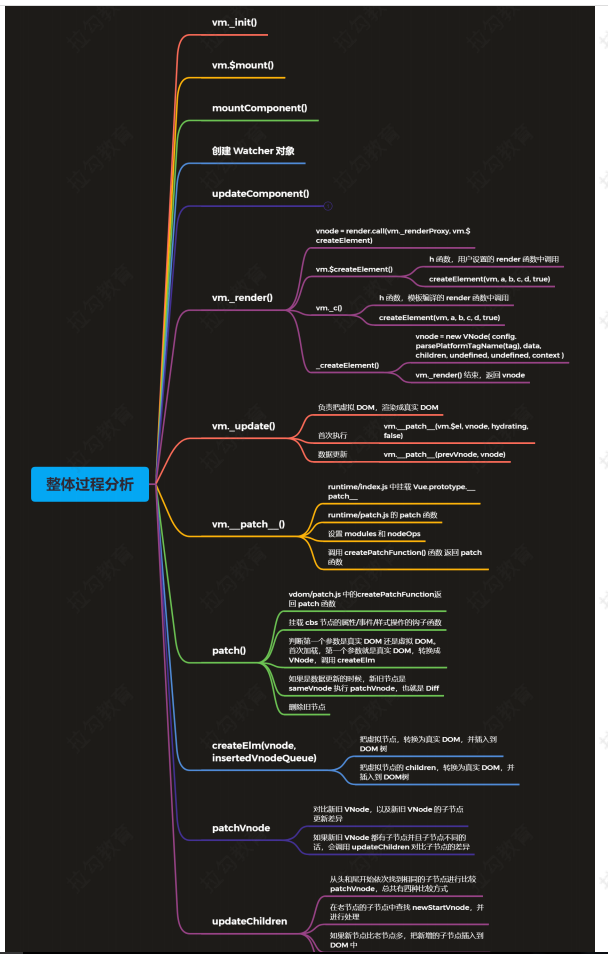

# 1. vue 源码剖析 - 虚拟 DOM

## 1.1 虚拟 DOM 回顾
什么是虚拟 DOM
- 虚拟 DOM(Virtual DOM) 是使用 JavaScript 对象来描述 DOM，虚拟 DOM 的本质就是 JavaScript 对象，使用 JavaScript 对象来描述 DOM 的结构。应用的各种状态变化首先作用于虚拟 DOM，最终映射到 DOM。
- Vue.js 中的虚拟 DOM 借鉴了 Snabbdom，并添加了一些 Vue.js 中的特性。
    - 例如：指令和组件机制。
- Vue 1.x 中细粒度监测数据的变化，每一个属性对应一个 watcher，开销太大Vue 2.x 中每个组件对应一个 watcher，状态变化通知到组件，再引入虚拟 DOM 进行比对和渲染

为什么要使用虚拟 DOM
- 使用虚拟 DOM，可以避免用户直接操作 DOM，开发过程关注在业务代码的实现，不需要关注如何操作 DOM，从而提高开发效率
- 作为一个中间层可以跨平台，除了 Web 平台外，还支持 SSR、Weex。
- 虚拟 DOM 不一定可以提高性能
    - 首次渲染的时候会增加开销
    - 复杂视图情况下提升渲染性能 
- 关于性能方面，在首次渲染的时候肯定不如直接操作 DOM，因为要维护一层额外的虚拟 DOM，如果后续有频繁操作 DOM 的操作，这个时候可能会有性能的提升，虚拟 DOM 在更新真实 DOM之前会通过 Diff 算法对比新旧两个虚拟 DOM 树的差异，最终把差异更新到真实 DOM

## 1.2 Vue.js 中的虚拟 DOM
- 演示 render 中的 h 函数
    - h 函数就是 createElement()
``` html
  <div id="app">
  </div>

  <script src="../../dist/vue.js"></script>
  <script>
    const vm = new Vue({
      el: '#app',
      render (h) {
          // 第一个参数支持  标签名，字符串，组件，slot
        // h(tag, data, children)
        // return h('h1', this.msg)
        // return h('h1', { domProps: { innerHTML: this.msg } })
        // return h('h1', { attrs: { id: 'title' } }, this.msg)
        const vnode = h(
          'h1', 
          { 
            attrs: { id: 'title' } 
          },
          this.msg
        )
        console.log(vnode)
        return vnode
      },
      data: {
        msg: 'Hello Vue'
      }
    })
  </script>
```
h函数
- vm.$createElement(tag,data,children,normalizeChildren)
    - tag 
        - 标签名称或者组件对象
    - data
        - 描述tag，可以设置 DOM 的属性或者标签的属性
    - children
        - tag 中的文本内容或者子节点
- h 函数返回 VNode

VNode
- VNode 的核心属性
    - tag       调用h函数的tag
    - data      调用h函数的data
    - children  调用h函数的children  (子节点)
    - text      调用h函数的children  (文本内容)
    - elm       记录真实dom
    - key

### 1.2.1 虚拟 DOM 创建过程


### 1.2.2 createElement   (vnode的创建过程)
找入口  src\core\instance\lifecycle.js
- 在updateComponent中调用了_render方法
``` js
// 1. src\core\instance\lifecycle.js
updateComponent = () => {
    // _render: 用户传入的 render 或者把 template 编译成的 render ,帮我们生成 vnode
    // _update: 里面调用了 patch 函数，对比两个 vnode 的差异，并且把差异更新到真实 dom 上来，也就是生成真实 dom
    vm._update(vm._render(), hydrating)
}

// 2. src\core\instance\render.js
Vue.prototype._render = function (): VNode {
      ....
    // 调用了 render 方法
    // 这个 render 方法是用户定义的 render 或者是模板渲染的 render，也就是渲染函数
    // 第一个参数是改变 render 的 this 指向
    // 第二个参数是 h 参数
    vnode = render.call(vm._renderProxy, vm.$createElement)
    
    ...
} 
// 3. 上面这个$createElemnt就是h函数
// 对编译生成的 render 进行渲染的方法
vm._c = (a, b, c, d) => createElement(vm, a, b, c, d, false)
// normalization is always applied for the public version, used in
// user-written render functions.
// 对手写 render 函数进行渲染的方法
vm.$createElement = (a, b, c, d) => createElement(vm, a, b, c, d, true)
```

功能
- createElement() 函数，用来创建虚拟节点 (VNode)，我们的 render 函数中的参数 h，就是createElement()
``` js
render(h) {
    // 此处的 h 就是 vm.$createElement
    return h('h1', this.msg)
}
```
定义

在 vm._render() 中调用了，用户传递的或者编译生成的 render 函数，这个时候传递了 createElement
- src/core/instance/render.js
``` js
// 对编译生成的 render 进行渲染的方法
vm._c = (a, b, c, d) => createElement(vm, a, b, c, d, false)
// normalization is always applied for the public version, used in
// user-written render functions.
// 对手写 render 函数进行渲染的方法
vm.$createElement = (a, b, c, d) => createElement(vm, a, b, c, d, true)
```
vm.c 和 vm.$createElement 内部都调用了 createElement，不同的是最后一个参数。vm.c 在编译生成的render 函数内部会调用，vm.$createElement 在用户传入的 render 函数内部调用。当用户传入render 函数的时候，要对用户传入的参数做处理
- src/core/vdom/create-element.js
执行完 createElement 之后创建好了 VNode，把创建好的 VNode 传递给 vm._update() 继续处理

``` js
// 判断参数的问题
export function createElement(
  context: Component,
  tag: any,
  data: any,
  children: any,
  normalizationType: any,
  alwaysNormalize: boolean
): VNode | Array<VNode> {
  // 判断第三个参数
  // 如果 data 是数组或者原始值的话就是 children，实现类似函数重载的机制
  if (Array.isArray(data) || isPrimitive(data)) {
    normalizationType = children
    children = data
    data = undefined
  }
  // 是否是用户传入的
  if (isTrue(alwaysNormalize)) {
    normalizationType = ALWAYS_NORMALIZE      // 用户传入的设置为 2
  }
  return _createElement(context, tag, data, children, normalizationType)
}

// 创建 vnode 对象
export function _createElement(
  context: Component,
  tag?: string | Class<Component> | Function | Object,
  data?: VNodeData,
  children?: any,
  normalizationType?: number
): VNode | Array<VNode> {
  // data 不为空，并且 data 是响应式数据
  // 开发环境就报一个警告： data 避免使用响应式数据
  if (isDef(data) && isDef((data: any).__ob__)) {
    process.env.NODE_ENV !== 'production' && warn(
      `Avoid using observed data object as vnode data: ${JSON.stringify(data)}\n` +
      'Always create fresh vnode data objects in each render!',
      context
    )
    // 返回一个空的 vnode 节点
    return createEmptyVNode()
  }
  // object syntax in v-bind
  // data 里面是否有 is 属性
  // <component v-bind:is="currentTabComponent"></component>
  // 这个 is 属性会把 currentTabComponent 渲染到 component 内部来
  if (isDef(data) && isDef(data.is)) {
    tag = data.is
  }

  if (!tag) {
    // in case of component :is set to falsy value
    return createEmptyVNode()
  }
  // warn against non-primitive key
  // 判断 data 是否定义，并且是否有 key 这个属性，key 是不是原始值
  // 如果不是原始就报一个警告：不能使用非原始值作为 key，
  // 只能使用 string/number 原始值作为 key
  if (process.env.NODE_ENV !== 'production' &&
    isDef(data) && isDef(data.key) && !isPrimitive(data.key)
  ) {
    if (!__WEEX__ || !('@binding' in data.key)) {
      warn(
        'Avoid using non-primitive value as key, ' +
        'use string/number value instead.',
        context
      )
    }
  }
  // support single function children as default scoped slot
  // 作用域插槽
  if (Array.isArray(children) &&
    typeof children[0] === 'function'
  ) {
    data = data || {}
    data.scopedSlots = { default: children[0] }
    children.length = 0
  }
  // normalizationType === ALWAYS_NORMALIZE 代表用户传入的 render 函数
  // 去处理 children
  if (normalizationType === ALWAYS_NORMALIZE) {
    // 当手写 render 函数的时候调用
    // 判断 children 的类型，如果是原始值的话转换成 文本VNode 的数组
    // 如果是数组的话，继续处理数组中的元素 (将多元数组转换成一元数组)
    // 如果数组中的子元素又是数组(slot template)，递归处理
    // 如果连续两个节点都是字符串会合并文本节点
    // normalizeChildren的作用是：帮我们把多元数组使用递归的方法转换成一元数组
    children = normalizeChildren(children)
  } else if (normalizationType === SIMPLE_NORMALIZE) {
    // 把二维数组转换为一维数组
    // 如果 children 中有函数组件的话，函数组件会返回数组形式
    // 这时候 children 就是一个二维数组，只需要把二维数组转换为一维数组
    children = simpleNormalizeChildren(children)
  }
  let vnode, ns
  // 判断 tag 是字符串还是组件
  if (typeof tag === 'string') {
    let Ctor
    ns = (context.$vnode && context.$vnode.ns) || config.getTagNamespace(tag)
    // 如果是浏览器的保留标签，创建对应的 VNode
    if (config.isReservedTag(tag)) {
      // platform built-in elements
      if (process.env.NODE_ENV !== 'production' && isDef(data) && isDef(data.nativeOn)) {
        warn(
          `The .native modifier for v-on is only valid on components but it was used on <${tag}>.`,
          context
        )
      }
      vnode = new VNode(
        config.parsePlatformTagName(tag), data, children,
        undefined, undefined, context
      )
    } else if ((!data || !data.pre) &&
      isDef(Ctor = resolveAsset(context.$options, 'components', tag))) {
      // component
      // 判断是否是自定义组件
      // 查找自定义组件构造函数的声明
      // 根据 Ctor 创建组件的 VNode
      vnode = createComponent(Ctor, data, context, children, tag)
    } else {
      // unknown or unlisted namespaced elements
      // check at runtime because it may get assigned a namespace when its
      // parent normalizes children
      // 自定义标签
      vnode = new VNode(
        tag, data, children,
        undefined, undefined, context
      )
    }
  } else {
    // direct component options / constructor
    // 不是字符串就是一个组件
    vnode = createComponent(tag, data, context, children)
  }
  if (Array.isArray(vnode)) {
    // 返回 vnode
    return vnode
  } else if (isDef(vnode)) {
    // 处理命名空间
    if (isDef(ns)) applyNS(vnode, ns)
    if (isDef(data)) registerDeepBindings(data)
    // 返回 vnode
    return vnode
  } else {
    // 返回一个空的注释节点
    return createEmptyVNode()
  }
}
```

### 1.2.3 update (vnode的处理过程)
功能
- 内部调用 vm.__patch__() 把虚拟 DOM 转换成真实 DOM
定义
- src/core/instance/lifecycle.js
``` js
// 1. update 方法在这里调用
updateComponent = () => {
    // _render: 用户传入的 render 或者把 template 编译成的 render ,帮我们生成 vnode
    // _update: 里面调用了 patch 函数，对比两个 vnode 的差异，并且把差异更新到真实 dom 上来，也就是生成真实 dom
    vm._update(vm._render(), hydrating)
}

// 2. update 内部做了什么
// _update 方法的作用是把 Vnode 渲染成真实的 DOM
// 首次渲染会调用，数据更新会调用
Vue.prototype._update = function (vnode: VNode, hydrating?: boolean) {
    const vm: Component = this
    const prevEl = vm.$el
    // 获取之前处理的 vnode
    const prevVnode = vm._vnode
    const restoreActiveInstance = setActiveInstance(vm)
    vm._vnode = vnode
    // Vue.prototype.__patch__ is injected in entry points
    // based on the rendering backend used.
    // 1. 是否是首次渲染
    if (!prevVnode) {
        // initial render
        // 1.1 首次渲染
        // 将虚拟dom转换成真实dom，并挂载到$el上
        vm.$el = vm.__patch__(vm.$el, vnode, hydrating, false /* removeOnly */)
    } else {
        // updates
        // 1.2 数据变化
        // 对比新旧两个 vnode 的差异，并且把差异更新到真实 dom 上
        vm.$el = vm.__patch__(prevVnode, vnode)
    }
    restoreActiveInstance()
    // update __vue__ reference
    if (prevEl) {
        prevEl.__vue__ = null
    }
    if (vm.$el) {
        vm.$el.__vue__ = vm
    }
    // if parent is an HOC, update its $el as well
    if (vm.$vnode && vm.$parent && vm.$vnode === vm.$parent._vnode) {
        vm.$parent.$el = vm.$el
    }
    // updated hook is called by the scheduler to ensure that children are
    // updated in a parent's updated hook.
}
```

### 1.2.4 patch 函数初始化  (vnode的处理过程)
功能
- 对比两个 VNode 的差异，把差异更新到真实 DOM。如果是首次渲染的话，会把真实 DOM 先转换成VNode

Snabbdom 中 patch 函数的初始化
- src/snabbdom.ts
``` js
export function init (modules: Array<Partial<Module>>, domApi?: DOMAPI) {
    return function patch (oldVnode: VNode | Element, vnode: VNode): VNode {
    }
}
```
- vnode
``` js
export function vnode (sel: string | undefined,
    data: any | undefined,
    children: Array<VNode | string> | undefined,
    text: string | undefined,
    elm: Element | Text | undefined): VNode {
    const key = data === undefined ? undefined : data.key
    return { sel, data, children, text, elm, key }
}
```

Vue.js 中 patch 函数的初始化
- src/platforms/web/runtime/index.js
``` js
import { patch } from './patch'
// install platform patch function
// 3. 设置平台相关的 __patch__ 方法（打补丁方法，对比新旧的 VNode）
Vue.prototype.__patch__ = inBrowser ? patch : noop
```
- src/platforms/web/runtime/patch.js
``` js
import * as nodeOps from 'web/runtime/node-ops'
import { createPatchFunction } from 'core/vdom/patch'
import baseModules from 'core/vdom/modules/index'
import platformModules from 'web/runtime/modules/index'
// the directive module should be applied last, after all
// built-in modules have been applied.
const modules = platformModules.concat(baseModules)
export const patch: Function = createPatchFunction({ nodeOps, modules })
```
- src/core/vdom/patch.js
``` js
// 返回一个 patch 函数
export function createPatchFunction(backend) {
  let i, j
  const cbs = {}

  // modules 节点的属性/事件/样式的操作
  // nodeOps 节点操作
  const { modules, nodeOps } = backend

  // 遍历 hooks 钩子函数    create,activate,update,remove,destroy
  for (i = 0; i < hooks.length; ++i) {
    // cbs["update"] = []
    cbs[hooks[i]] = []
    for (j = 0; j < modules.length; ++j) {
      if (isDef(modules[j][hooks[i]])) {
        // cbs["update"] = [updateAttrs,updateClass,update...]
        cbs[hooks[i]].push(modules[j][hooks[i]])
      }
    }
  }}   
    }
    ……
    ……
    ……
    // 函数柯里化，让一个函数返回一个函数
    // createPatchFunction({nodeOps, modules}) 传入平台相关的两个参数

    // core 中的 createPatchFunction(backend),const {modules,nodeOps} = backend
    // core 中方法和平台无关，传入两个参数后，可以在上面的函数中使用这两个参数
    return function patch(oldVnode, vnode, hydrating, removeOnly) {
    }
}
```


### 1.2.5 patch 函数执行过程  (vnode的处理过程)
``` js
// 函数柯里化，让一个函数返回一个函数
  // createPatchFunction({nodeOps, modules}) 传入平台相关的两个参数

  // core 中的 createPatchFunction(backend),const {modules,nodeOps} = backend
  // core 中方法和平台无关，传入两个参数后，可以在上面的函数中使用这两个参数
  return function patch(oldVnode, vnode, hydrating, removeOnly) {
    // 如果没有 vnode 
    if (isUndef(vnode)) {
      // 老的 VNode 存在，执行销毁(Destroy)的钩子函数
      if (isDef(oldVnode)) invokeDestroyHook(oldVnode)
      return
    }

    let isInitialPatch = false
    // 新插入的 vnode 节点队列，
    // 以便于后面调用这些新插入的 vnode 的 insertHook 钩子函数
    const insertedVnodeQueue = []
    // 老的 VNode 不存在
    if (isUndef(oldVnode)) {
      // empty mount (likely as component), create new root element
      // 如果没有 oldVnode，创建 vnode 对应的真实 DOM,
      // 只是存储在内存中，并没有挂载到 真实 DOM 上，
      // 也就是设置了 vnode 的 elm 属性 
      // 因为此时它的 parentElm 不存在
      isInitialPatch = true
      createElm(vnode, insertedVnodeQueue)
    } else {
      // 新的和老的 VNode 都存在，更新
      const isRealElement = isDef(oldVnode.nodeType)
      // oldVnode 不是真实 DOM，并且两个 VNode 是 sameVnode(相同节点)
      if (!isRealElement && sameVnode(oldVnode, vnode)) {
        // patch existing root node
        // 这个时候开始执行 Diff    (更新操作)
        patchVnode(oldVnode, vnode, insertedVnodeQueue, null, null, removeOnly)
      } else {
        // oldVnode是真实DOM，创建 VNode
        // 首次渲染
        if (isRealElement) {
          // mounting to a real element
          // check if this is server-rendered content and if we can perform
          // a successful hydration.
          if (oldVnode.nodeType === 1 && oldVnode.hasAttribute(SSR_ATTR)) {
            oldVnode.removeAttribute(SSR_ATTR)
            hydrating = true
          }
          if (isTrue(hydrating)) {
            if (hydrate(oldVnode, vnode, insertedVnodeQueue)) {
              invokeInsertHook(vnode, insertedVnodeQueue, true)
              return oldVnode
            } else if (process.env.NODE_ENV !== 'production') {
              warn(
                'The client-side rendered virtual DOM tree is not matching ' +
                'server-rendered content. This is likely caused by incorrect ' +
                'HTML markup, for example nesting block-level elements inside ' +
                '<p>, or missing <tbody>. Bailing hydration and performing ' +
                'full client-side render.'
              )
            }
          }
          // either not server-rendered, or hydration failed.
          // create an empty node and replace it
          // 将 oldVnode 转换成 vnode 节点
          // oldVnode.elm 就是 真实DOM
          oldVnode = emptyNodeAt(oldVnode)
        }

        // replacing existing element
        // 找真实DOM的父元素
        // 找父元素的目的是：将来我们把 vnode 转换成真实DOM的时候，
        // 挂载到parentElm 父元素上。
        const oldElm = oldVnode.elm
        const parentElm = nodeOps.parentNode(oldElm)

        // create new node
        // 创建 DOM 节点
        // createElm 的作用就是把 vnode 转换成真实DOM挂载到parentEle上来
        createElm(
          vnode,
          insertedVnodeQueue,
          // extremely rare edge case: do not insert if old element is in a
          // leaving transition. Only happens when combining transition +
          // keep-alive + HOCs. (#4590)
          // 如果当前正在执行过渡动画transition，就把parentElm参数设置为null
          // 如果parentElm为null,并不会把真实DOM挂载到页面上来
          oldElm._leaveCb ? null : parentElm,
          // 把 vnode 转换成的真实DOM插入到nodeOps之前
          nodeOps.nextSibling(oldElm)
        )

        // update parent placeholder node element, recursively
        if (isDef(vnode.parent)) {
          let ancestor = vnode.parent
          const patchable = isPatchable(vnode)
          while (ancestor) {
            for (let i = 0; i < cbs.destroy.length; ++i) {
              cbs.destroy[i](ancestor)
            }
            ancestor.elm = vnode.elm
            if (patchable) {
              for (let i = 0; i < cbs.create.length; ++i) {
                cbs.create[i](emptyNode, ancestor)
              }
              // #6513
              // invoke insert hooks that may have been merged by create hooks.
              // e.g. for directives that uses the "inserted" hook.
              const insert = ancestor.data.hook.insert
              if (insert.merged) {
                // start at index 1 to avoid re-invoking component mounted hook
                for (let i = 1; i < insert.fns.length; i++) {
                  insert.fns[i]()
                }
              }
            } else {
              registerRef(ancestor)
            }
            ancestor = ancestor.parent
          }
        }

        // destroy old node
        // 销毁 oldNode
        if (isDef(parentElm)) {
          removeVnodes([oldVnode], 0, 0)
        } else if (isDef(oldVnode.tag)) {
          invokeDestroyHook(oldVnode)
        }
      }
    }
    // 触发所有要插入的vnode的insertHook钩子函数
    // isInitialPatch 这个变量记录我们当前vnode并没有挂载在DOM树上，
    // 而是存在内存中, 如果 isInitialPatch 为 true的话就不会执行 
    // insertedVnodeQueue 里面的钩子函数，会把他存起来，下次再执行。
    invokeInsertHook(vnode, insertedVnodeQueue, isInitialPatch)
    return vnode.elm
  }
```

### 1.2.6 createElm  (vnode的处理过程)
createElm 把 VNode 转换成真实DOM,并挂载到真实DOM 上
``` js
  let creatingElmInVPre = 0
  // createElm 把 VNode 转换成真实DOM,并挂载到真实DOM 上
  function createElm(
    vnode,  // 虚拟DOM
    insertedVnodeQueue,   // 插入的vnode队列
    parentElm,      // 挂载到的父元素
    refElm,       // 如果这个元素不为空的话，会把 vnode 转换成的真实DOM 插在他之前
    nested,
    ownerArray,
    index
  ) {
    // vnode 已经渲染过，并且有子节点
    if (isDef(vnode.elm) && isDef(ownerArray)) {
      // This vnode was used in a previous render!
      // now it's used as a new node, overwriting its elm would cause
      // potential patch errors down the road when it's used as an insertion
      // reference node. Instead, we clone the node on-demand before creating
      // associated DOM element for it.
      // 把 vnode 克隆一份,vnode里面的子节点也会克隆一份 
      vnode = ownerArray[index] = cloneVNode(vnode)
    }

    vnode.isRootInsert = !nested // for transition enter check
    // 创建组件
    if (createComponent(vnode, insertedVnodeQueue, parentElm, refElm)) {
      return
    }

    const data = vnode.data
    const children = vnode.children
    const tag = vnode.tag
    // vnode 是标签
    if (isDef(tag)) {
      // 是开发环境
      if (process.env.NODE_ENV !== 'production') {
        if (data && data.pre) {
          creatingElmInVPre++
        }
        // 不是html的标签，也就是自定义标签，
        // 会发送警告：
        if (isUnknownElement(vnode, creatingElmInVPre)) {
          warn(
            'Unknown custom element: <' + tag + '> - did you ' +
            'register the component correctly? For recursive components, ' +
            'make sure to provide the "name" option.',
            vnode.context
          )
        }
      }

      vnode.elm = vnode.ns
        ? nodeOps.createElementNS(vnode.ns, tag)
        : nodeOps.createElement(tag, vnode)
      setScope(vnode)

      /* istanbul ignore if */
      if (__WEEX__) {
        // in Weex, the default insertion order is parent-first.
        // List items can be optimized to use children-first insertion
        // with append="tree".
        const appendAsTree = isDef(data) && isTrue(data.appendAsTree)
        if (!appendAsTree) {
          if (isDef(data)) {
            invokeCreateHooks(vnode, insertedVnodeQueue)
          }
          insert(parentElm, vnode.elm, refElm)
        }
        createChildren(vnode, children, insertedVnodeQueue)
        if (appendAsTree) {
          if (isDef(data)) {
            invokeCreateHooks(vnode, insertedVnodeQueue)
          }
          insert(parentElm, vnode.elm, refElm)
        }
      } else {
        // 创建子节点
        createChildren(vnode, children, insertedVnodeQueue)
        // data 有值，执行钩子函数
        if (isDef(data)) {
          invokeCreateHooks(vnode, insertedVnodeQueue)
        }
        // 把 vnode 创建的 真实DOM插入到parentElm里面去
        // 如果有refElm，并且refElm的parentNode等于parentElm,
        // 就把vnode创建的真实DOM插入到他之前
        insert(parentElm, vnode.elm, refElm)
      }

      if (process.env.NODE_ENV !== 'production' && data && data.pre) {
        creatingElmInVPre--
      }
    } else if (isTrue(vnode.isComment)) {
      // vnode 是否是注释节点
      vnode.elm = nodeOps.createComment(vnode.text)
      insert(parentElm, vnode.elm, refElm)
    } else {
      // vnode 是本文节点
      vnode.elm = nodeOps.createTextNode(vnode.text)
      insert(parentElm, vnode.elm, refElm)
    }
  }
```

### 1.2.7 patchVnode  (vnode的处理过程)
在createEle方法中如果新老节点都不是真实 DOM，并且两个 VNode 是 sameVnode(相同节点)，就调用patchVnode开始执行 Diff (更新操作)
- 如果新旧节点是完全相同的节点，直接返回
- 新老节点都有文本节点
  - 直接把新节点的 text 更新到 DOM 上
- 新节点没有文本(说明有可能有子元素)
  - 老节点和新节点都有子节点
    - 对子节点进行 diff 操作，调用 updateChildren 对比和更新子节点
  - 新的有子节点，老的没有子节点
    - 先清空老节点 DOM 的文本内容
    - 把新节点下的子节点转换为 DOM 元素，并且添加到DOM数
  - 老节点有子节点，新的没有子节点
    - 删除老节点中的子节点
  - 老节点有文本，新节点没有文本
    - 清空老节点的文本内容
- 源码内容如下
``` js
// 开启 diff 算法，更新DOM操作
  function patchVnode(
    oldVnode,
    vnode,
    insertedVnodeQueue,
    ownerArray,
    index,
    removeOnly
  ) {
    // 如果新旧节点是完全相同的节点，直接返回
    if (oldVnode === vnode) {
      return
    }

    if (isDef(vnode.elm) && isDef(ownerArray)) {
      // clone reused vnode
      vnode = ownerArray[index] = cloneVNode(vnode)
    }

    const elm = vnode.elm = oldVnode.elm

    if (isTrue(oldVnode.isAsyncPlaceholder)) {
      if (isDef(vnode.asyncFactory.resolved)) {
        hydrate(oldVnode.elm, vnode, insertedVnodeQueue)
      } else {
        vnode.isAsyncPlaceholder = true
      }
      return
    }

    // reuse element for static trees.
    // note we only do this if the vnode is cloned -
    // if the new node is not cloned it means the render functions have been
    // reset by the hot-reload-api and we need to do a proper re-render.
    // 如果新旧 VNode 都是静态的，那么只需要替换 componentInstance
    if (isTrue(vnode.isStatic) &&
      isTrue(oldVnode.isStatic) &&
      vnode.key === oldVnode.key &&
      (isTrue(vnode.isCloned) || isTrue(vnode.isOnce))
    ) {
      vnode.componentInstance = oldVnode.componentInstance
      return
    }
    // 触发 prepatch 钩子函数
    let i
    const data = vnode.data
    if (isDef(data) && isDef(i = data.hook) && isDef(i = i.prepatch)) {
      i(oldVnode, vnode)
    }
    // 获取新旧节点的子节点
    const oldCh = oldVnode.children
    const ch = vnode.children
    // 触发 update 钩子函数
    if (isDef(data) && isPatchable(vnode)) {
      // 调用 cbs 中的钩子函数，操作节点的属性/样式/事件...
      for (i = 0; i < cbs.update.length; ++i) cbs.update[i](oldVnode, vnode)
      // 用户自定义的钩子
      if (isDef(i = data.hook) && isDef(i = i.update)) i(oldVnode, vnode)
    }
    // 核心功能：对比新旧两个节点的差异 *** 
    // 1. 新节点没有文本(说明有可能有子元素)
    if (isUndef(vnode.text)) {
      // 1.1 老节点和新节点都有子节点
      // 对子节点进行 diff 操作，调用 updateChildren 对比和更新子节点
      if (isDef(oldCh) && isDef(ch)) {
        if (oldCh !== ch) updateChildren(elm, oldCh, ch, insertedVnodeQueue, removeOnly)
      } else if (isDef(ch)) {
        // 1.2 新的有子节点，老的没有子节点
        // 在开发环境中，检查新老节点中是否有重复的key，
        // 如果有重复的key在开发环境中报警告
        if (process.env.NODE_ENV !== 'production') {
          checkDuplicateKeys(ch)
        }
        // 先清空老节点 DOM 的文本内容
        if (isDef(oldVnode.text)) nodeOps.setTextContent(elm, '')
        // 把新节点下的子节点转换为 DOM 元素，并且添加到DOM数
        addVnodes(elm, null, ch, 0, ch.length - 1, insertedVnodeQueue)
      } else if (isDef(oldCh)) {
        // 1.3 老节点有子节点，新的没有子节点
        // 删除老节点中的子节点
        removeVnodes(oldCh, 0, oldCh.length - 1)
      } else if (isDef(oldVnode.text)) {
        // 1.4 老节点有文本，新节点没有文本
        // 清空老节点的文本内容
        nodeOps.setTextContent(elm, '')
      }
    } else if (oldVnode.text !== vnode.text) {
      // 2. 新老节点都有文本节点
      // 直接把新节点的 text 更新到 DOM 上
      nodeOps.setTextContent(elm, vnode.text)
    }
    // 触发 postpatch 钩子函数
    if (isDef(data)) {
      if (isDef(i = data.hook) && isDef(i = i.postpatch)) i(oldVnode, vnode)
    }
  }
```


### 1.2.8 updateChildren  (vnode的处理过程)
在patchNode中老节点和新节点都有子节点，对子节点进行 diff 操作，调用 updateChildren 对比和更新子节点

- 有如下几个属性
  - oldStartIdx 老节点的开始索引
  - newStartIdx 新节点的开始索引
  - oldEndIdx 老节点的结束索引
  - newEndIdx 新节点的结束索引
  - oldStartVnode 老节点开始本身
  - newStartVnode 新节点开始本身
  - oldEndVnode   老节点结束本身
  - newEndVnode   新节点结束本身
  - sameVnode   对比两个节点的key和tag是否相等
  - vnodeToMove 通过新节点的key找到老节点相同key的节点


- 通过上面的属性，遍历新老节点来进行对比新老节点
- oldStartIdx <= oldEndIdx && newStartIdx <= newEndIdx 遍历新老节点，修改老节点的内容和顺序
  - oldStartVnode 和 newStartVnode 相同(sameVnode)  新老开始节点相同
    - 直接将该 Vnode 节点进行 patchVnode
    - 获取下一组开始节点
  - oldEndVnode 和 newEndVnode 相同(sameVnode)  新老结束节点相同
    - 直接将该 Vnode 节点进行 patchVnode
    - 获取下一组开始节点
  - oldStartVnode 和 newEndVnode 相同(sameVnode) 老的开始节点和新的结束节点相同
    - 进行 patchVnode，把 oldStartVnode 移动到最后
    - 获取下一组开始节点
  - oldEndVnode 和 newStartVnode 相同(sameVnode) 老的结束节点和新的开始节点相同
    - 进行 patchVnode，把 oldEndVnode 移动到最前
    - 获取下一组开始节点
  - 以上4种情况都不满足，就执行如下查找方式
    - 从新的节点开始获取一个，通过key去老节点中查找相同key的节点
      - 如果没有找到老节点
        -  创建节点并插入到最前面
      - 找到老节点
        -  newStartVnode 和 vnodeToMove 是否(sameVnode)  
          - 新节点和找到的老节点相同
            -  进行 patchVnode，并且把找到的老节点移动到最前面
          - 新节点和找到的老节点不相同
            - 如果key相同，但是是不同的元素，创建新的元素
    - 获取下一组开始节点
- 当结束时 oldStartIdx > oldEndIdx，旧节点遍历完，但是新节点没有
  - 说明新节点比老节点多，把剩下的新节点插入到老的节点后面
- 当结束时 newStartIndex > newEndIdx，新节点遍历完，但是旧节点还没有
  - 把老节点剩余的节点批量删除
- 源码如下：
``` js
 // diff 算法
  // 更新新旧节点的子节点
  function updateChildren(parentElm, oldCh, newCh, insertedVnodeQueue, removeOnly) {
    // 新老节点的开始索引
    let oldStartIdx = 0
    let newStartIdx = 0
    // 新老节点的结束索引
    // 新老节点开始和结束本身
    let oldEndIdx = oldCh.length - 1
    let oldStartVnode = oldCh[0]
    let oldEndVnode = oldCh[oldEndIdx]
    let newEndIdx = newCh.length - 1
    let newStartVnode = newCh[0]
    let newEndVnode = newCh[newEndIdx]
    let oldKeyToIdx, idxInOld, vnodeToMove, refElm

    // removeOnly is a special flag used only by <transition-group>
    // to ensure removed elements stay in correct relative positions
    // during leaving transitions
    const canMove = !removeOnly
    // 新老节点是否有重复的key，如果有重复的key在开发环境中报警告
    if (process.env.NODE_ENV !== 'production') {
      checkDuplicateKeys(newCh)
    }
    // diff 算法   
    // 当新节点和旧节点都没有遍历完成
    // 核心功能： 对比新老子节点 *****
    while (oldStartIdx <= oldEndIdx && newStartIdx <= newEndIdx) {
      // 老的开始节点是否有值，没有值，取下一个老的子节点
      if (isUndef(oldStartVnode)) {
        oldStartVnode = oldCh[++oldStartIdx] // Vnode has been moved left
      } else if (isUndef(oldEndVnode)) {
        // 老的结束节点是否有值，没有值获取上一个老的子节点
        oldEndVnode = oldCh[--oldEndIdx]
      } else if (sameVnode(oldStartVnode, newStartVnode)) {
        // 1. oldStartVnode 和 newStartVnode 相同(sameVnode)  新老开始节点相同
        // 直接将该 Vnode 节点进行 patchVnode
        patchVnode(oldStartVnode, newStartVnode, insertedVnodeQueue, newCh, newStartIdx)
        // 获取下一组开始节点
        oldStartVnode = oldCh[++oldStartIdx]
        newStartVnode = newCh[++newStartIdx]
      } else if (sameVnode(oldEndVnode, newEndVnode)) {
        // 2. oldEndVnode 和 newEndVnode 相同(sameVnode)  新老结束节点相同
        // 直接将该 Vnode 节点进行 patchVnode
        patchVnode(oldEndVnode, newEndVnode, insertedVnodeQueue, newCh, newEndIdx)
        // 获取下一组开始节点
        oldEndVnode = oldCh[--oldEndIdx]
        newEndVnode = newCh[--newEndIdx]
      } else if (sameVnode(oldStartVnode, newEndVnode)) { // Vnode moved right
        // 3. oldStartVnode 和 newEndVnode 相同(sameVnode) 老的开始节点和新的结束节点相同
        // 进行 patchVnode，把 oldStartVnode 移动到最后
        patchVnode(oldStartVnode, newEndVnode, insertedVnodeQueue, newCh, newEndIdx)
        canMove && nodeOps.insertBefore(parentElm, oldStartVnode.elm, nodeOps.nextSibling(oldEndVnode.elm))
        // 获取下一组开始节点
        oldStartVnode = oldCh[++oldStartIdx]
        newEndVnode = newCh[--newEndIdx]
      } else if (sameVnode(oldEndVnode, newStartVnode)) { // Vnode moved left
        // 4. oldEndVnode 和 newStartVnode 相同(sameVnode) 老的结束节点和新的开始节点相同
        // 进行 patchVnode，把 oldEndVnode 移动到最前
        patchVnode(oldEndVnode, newStartVnode, insertedVnodeQueue, newCh, newStartIdx)
        canMove && nodeOps.insertBefore(parentElm, oldEndVnode.elm, oldStartVnode.elm)
        // 获取下一组开始节点
        oldEndVnode = oldCh[--oldEndIdx]
        newStartVnode = newCh[++newStartIdx]
      } else {
        // 5. 以上4种情况都不满足
        // newStartNode 依次和旧的节点比较

        // 5.1 从新的节点开始获取一个，去老节点中查找相同节点
        // 先从新开始节点的key找老节点相同key的索引
        if (isUndef(oldKeyToIdx)) oldKeyToIdx = createKeyToOldIdx(oldCh, oldStartIdx, oldEndIdx)
        idxInOld = isDef(newStartVnode.key)
          ? oldKeyToIdx[newStartVnode.key]
          : findIdxInOld(newStartVnode, oldCh, oldStartIdx, oldEndIdx)
        // 5.1 如果没有找到老节点的索引
        if (isUndef(idxInOld)) { // New element
          // 创建节点并插入到最前面
          createElm(newStartVnode, insertedVnodeQueue, parentElm, oldStartVnode.elm, false, newCh, newStartIdx)
        } else {
          // 5.2 找到老节点的索引
          // 获取要移动的老节点
          vnodeToMove = oldCh[idxInOld]
          // 5.2.1 如果新节点和找到的老节点相同
          if (sameVnode(vnodeToMove, newStartVnode)) {
            // 进行 patchVnode，并且把找到的老节点移动到最前面
            patchVnode(vnodeToMove, newStartVnode, insertedVnodeQueue, newCh, newStartIdx)
            oldCh[idxInOld] = undefined
            canMove && nodeOps.insertBefore(parentElm, vnodeToMove.elm, oldStartVnode.elm)
          } else {
            // same key but different element. treat as new element
            // 5.2.2 新节点和找到的老节点不相同
            // 如果key相同，但是是不同的元素，创建新的元素
            createElm(newStartVnode, insertedVnodeQueue, parentElm, oldStartVnode.elm, false, newCh, newStartIdx)
          }
        }
        newStartVnode = newCh[++newStartIdx]
      }
    }
    // 当结束时 oldStartIdx > oldEndIdx，旧节点遍历完，但是新节点没有
    if (oldStartIdx > oldEndIdx) {
      // 说明新节点比老节点多，把剩下的新节点插入到老的节点后面
      refElm = isUndef(newCh[newEndIdx + 1]) ? null : newCh[newEndIdx + 1].elm
      addVnodes(parentElm, refElm, newCh, newStartIdx, newEndIdx, insertedVnodeQueue)
    } else if (newStartIdx > newEndIdx) {
      // 当结束时 newStartIndex > newEndIdx，新节点遍历完，但是旧节点还没有
      // 把老节点剩余的节点批量删除
      removeVnodes(oldCh, oldStartIdx, oldEndIdx)
    }
  }
```

updateChildren 和 Snabbdom 中的 updateChildren 整体算法一致。

我们再来看下它处理过程中 key 的作用，在 patch 函数中，调用 patchVnode 之前，会首先调用 sameVnode()判断当前的新老 VNode 是否是相同节点，sameVnode() 中会首先判断 key 是否相同。
- 通过下面代码来体会 key 的作用
``` html
<div id="app">
    <button @click="handler">按钮</button>
    <ul>
      <li v-for="value in arr" :key="value">{{value}}</li>
    </ul>
  </div>
  <script src="../../dist/vue.js"></script>
  <script>
    const vm = new Vue({
      el: '#app',
      data: {
        arr: ['a', 'b', 'c', 'd']
      },
      methods: {
        handler () {
          this.arr.splice(1, 0, 'x')
          // this.arr = ['a', 'x', 'b', 'c', 'd']
        }
      }
    })
  </script>
```

当没有设置 key 的时候
- 在 updateChildren 中比较子节点的时候，会做三次更新 DOM 操作和一次插入 DOM 的操作

当设置 key 的时候
- 在 updateChildren 中比较子节点的时候，因为 oldVnode 的子节点的 b,c,d 和 newVnode 的 x,b,c 的key 相同，所以只做比较，没有更新 DOM 的操作，只有移动 DOM 的操作，当遍历完毕后，会再把 x 插入到 DOM 上DOM 操作只有一次插入操作。

设置和没有设置key比较的方式：
- 当设置 key 的时候，updateChildren 更新子节点的时候，会通过新节点的key找老节点相同key的老节点，并进行移动操作
- 当没有设置 key 的时候，updateChildren 就找不到相同 sameVnode，就会更新DOM操作


## 1.3 总结：
