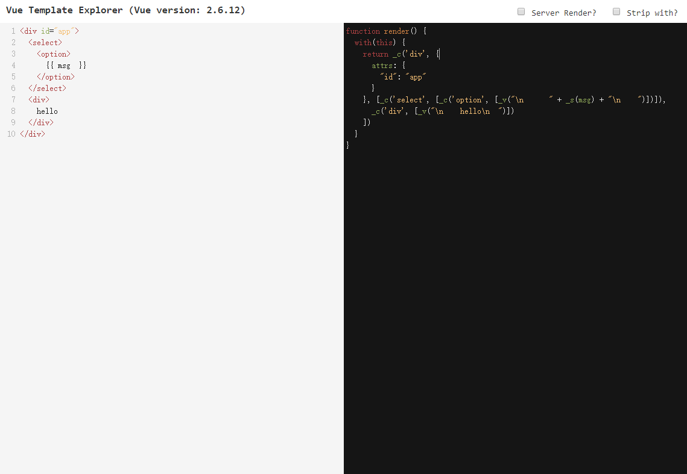
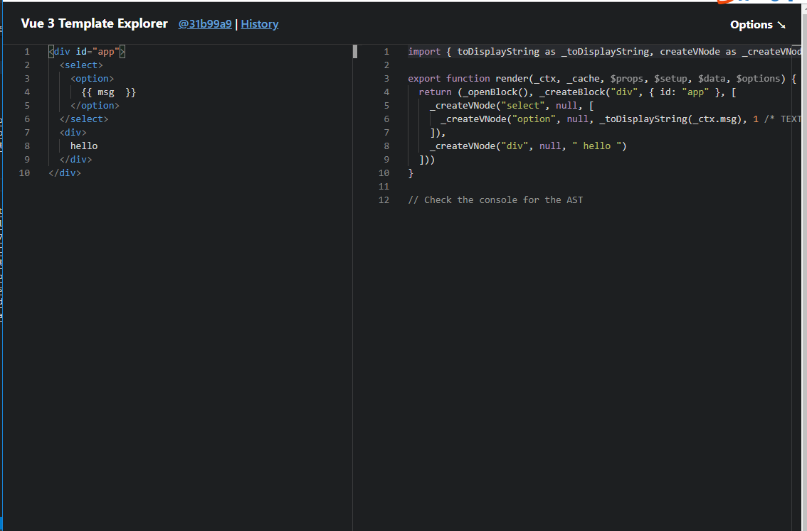
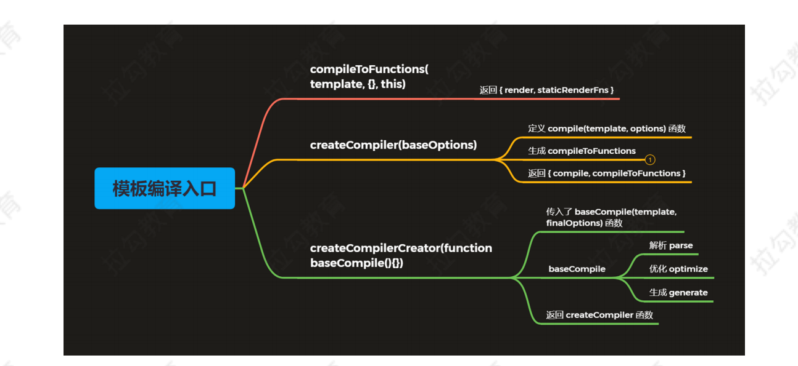

# 1. Vue 源码剖析-模板编译和组件化

## 1.1 模板编译
- 模板编译的主要目的是将模板 (template) 转换为渲染函数 (render)
``` js
<div>
    <h1 @click="handler">title</h1>
    <p>some content</p>
</div>
```
- 渲染函数 render
``` js
render (h) {
    return h('div', [
        h('h1', { on: { click: this.handler} }, 'title'),
        h('p', 'some content')
    ])
}
```
- 模板编译的作用
    - Vue 2.x 使用 VNode 描述视图以及各种交互，用户自己编写 VNode 比较复杂
    - 用户只需要编写类似 HTML 的代码 - Vue 模板，通过编译器将模板转换为返回 VNode 的render 函数
    - .vue 文件会被 webpack 在构建的过程中转换成 render 函数
        - webpack 本身是不支持把模板编译成 render 函数
        - webpack 内部是通过 VNode 来进行操作的
- 根据运行的时间，我们可以把编译的过程分为运行时编译和创建时(打包时)编译
    - 运行时编译
        - 前提： 是使用完整版的 Vue,因为完整版的 Vue，才带编译器，他在项目运行的过程中把模板编译成 render 函数，
        - 缺点：Vue 体积大，并且运行特别慢
    - 创建时编译
        - Vue-cli 默认就是 运行版的 Vue, 不带编译器，体积小，因为他没有编辑器，所以需要创建时编译，也就是打包的时候 webpack 通过 VNode 编译成 render 函数
        - 优点： 体积小，运行速度快

### 1.1.1 体验模板编译的结果
- 带编译器版本的 Vue.js 中，使用 template 或 el 的方式设置模板
``` html
<div id="app">
    <h1>Vue<span>模板编译过程</span></h1>
    <p>{{ msg }}</p>
    <comp @myclick="handler"></comp>
  </div>
  <script src="../../dist/vue.js"></script>
  <script>
    Vue.component('comp', {
      template: '<div>I am a comp</div>'
    })
    const vm = new Vue({
      el: '#app',
      data: {
        msg: 'Hello compiler'
      },
      methods: {
        handler () {
          console.log('test')
        }
      }
    })
    console.log(vm.$options.render)
  </script>
```
- 编译后 render 输出的结果
``` js
(function anonymous() {
    with (this) {
        return _c(
        "div",
        { attrs: { id: "app" } },       // id属性
         // children子节点
        [
            _m(0),      // 静态内容，也就是没有使用模板的html元素
            _v(" "),            // 空白文本VNode
            // _c children子节点
            // _v 子节点
            // _s 把 msg 转换成字符串
            _c("p", [_v(_s(msg))]), 
            _v(" "),     // 文本VNode
            _c("comp", { on: { myclick: handler } }),
        ],
        1           // 1 就是把children拆平，如果children是二维数组，变成一维数组
        );
    }
});
```
- _c 是 createElement() 方法，定义的位置 instance/render.js 中
    - 其实就是创建VNode 对象的
``` js
// 对编译生成的 render 进行渲染的方法
vm._c = (a, b, c, d) => createElement(vm, a, b, c, d, false)
// normalization is always applied for the public version, used in
// user-written render functions.
// 对手写 render 函数进行渲染的方法
vm.$createElement = (a, b, c, d) => createElement(vm, a, b, c, d, true)
```
- 相关的渲染函数(_开头的方法定义)，在 instance/render-helps/index.js 中
``` js
// instance/render-helps/index.js
target._v = createTextVNode
target._m = renderStatic
// core/vdom/vnode.js       创建文本VNode
export function createTextVNode(val: string | number) {
  return new VNode(undefined, undefined, undefined, String(val))
}
// 在 instance/render-helps/render-static.js
export function renderStatic(
  index: number,
  isInFor: boolean
): VNode | Array<VNode> {
  const cached = this._staticTrees || (this._staticTrees = [])
  let tree = cached[index]
  // if has already-rendered static tree and not inside v-for,
  // we can reuse the same tree.
  if (tree && !isInFor) {
    return tree
  }
  // otherwise, render a fresh tree.
  tree = cached[index] = this.$options.staticRenderFns[index].call(
    this._renderProxy,
    null,
    this // for render fns generated for functional component templates
  )
  markStatic(tree, `__static__${index}`, false)
  return tree
}
```
- 把 template 转换成 render 的入口 src\platforms\web\entry-runtime-with-compiler.js


### 1.1.2 Vue Template Explorer
- [vue-template-explor](https://template-explorer.vuejs.org/#%3Cdiv%20id%3D%22app%22%3E%0A%20%20%3Cselect%3E%0A%20%20%20%20%3Coption%3E%0A%20%20%20%20%20%20%7B%7B%20msg%20%20%7D%7D%0A%20%20%20%20%3C%2Foption%3E%0A%20%20%3C%2Fselect%3E%0A%20%20%3Cdiv%3E%0A%20%20%20%20hello%0A%20%20%3C%2Fdiv%3E%0A%3C%2Fdiv%3E)
    - Vue 2.6 把模板编译成 render 函数的工具



- [vue-next-template-explor](https://vue-next-template-explorer.netlify.app/#%7B%22src%22%3A%22%3Cdiv%20id%3D%5C%22app%5C%22%3E%5Cn%20%20%3Cselect%3E%5Cn%20%20%20%20%3Coption%3E%5Cn%20%20%20%20%20%20%7B%7B%20msg%20%20%7D%7D%5Cn%20%20%20%20%3C%2Foption%3E%5Cn%20%20%3C%2Fselect%3E%5Cn%20%20%3Cdiv%3E%5Cn%20%20%20%20hello%5Cn%20%20%3C%2Fdiv%3E%5Cn%3C%2Fdiv%3E%22%2C%22options%22%3A%7B%22mode%22%3A%22module%22%2C%22prefixIdentifiers%22%3Afalse%2C%22optimizeImports%22%3Afalse%2C%22hoistStatic%22%3Afalse%2C%22cacheHandlers%22%3Afalse%2C%22scopeId%22%3Anull%2C%22ssrCssVars%22%3A%22%7B%20color%20%7D%22%2C%22bindingMetadata%22%3A%7B%22TestComponent%22%3A%22setup%22%2C%22foo%22%3A%22setup%22%2C%22bar%22%3A%22props%22%7D%2C%22optimizeBindings%22%3Afalse%7D%7D)
    - Vue 3.0 beta 把模板编译成 render 函数的工具



总结： 
- 在使用 vue2.6 的时候，文本内容尽量不要添加空白内容
- 在 vue3 中没有这个问题，他已经去除了空白内容


## 1.2 模板编译过程   ***
- 解析、优化、生成

### 1.2.1 编译的入口
- src\platforms\web\entry-runtime-with-compiler.js
``` js
Vue.prototype.$mount = function (
    ……
    // 把 template 转换成 render 函数
    const { render, staticRenderFns } = compileToFunctions(template, {
    outputSourceRange: process.env.NODE_ENV !== 'production',
    shouldDecodeNewlines,
    shouldDecodeNewlinesForHref,
    delimiters: options.delimiters,
    comments: options.comments
    }, this)
    options.render = render
    options.staticRenderFns = staticRenderFns
    ……
)
```
编译入口的代码执行过程
- compileToFunctions将template编译成render函数和staticRenderFns                    src\platforms\web\entry-runtime-with-compiler.js
- createCompiler(baseOptions/编译函数的options)方法返回compileToFunctions          src\platforms\web\compiler\index.js
- createCompilerCreator(baseCompile/编译函数)就是调用下面的方法                     src\compiler\index.js               (****)
    - baseCompile函数才是最终实现模板编译的功能         (****)
    ``` js
    function baseCompile(
        template: string,
        options: CompilerOptions
    ): CompiledResult {
        // 1.解析-parse: 把模板转换成 ast 抽象语法树
        // 抽象语法树，用来以树性的方式描述代码结构
        const ast = parse(template.trim(), options)
        if (options.optimize !== false) {
            // 2.优化-optimize： 优化抽象语法树
            optimize(ast, options)
        }
        // 3.生成-generate: 把抽象语法树生成字符串形式的 js 代码
        const code = generate(ast, options)
        return {
            ast,
            // 渲染函数     
            // 此时的render是字符串render函数，需要to Function转换成render函数
            render: code.render,    
            // 静态渲染函数，生成静态 VNode 树
            staticRenderFns: code.staticRenderFns
        }
    }
    ```
- createCompilerCreator(baseCompile/编译函数)方法返回createCompiler                src\compiler\create-compiler.js
    - 这个方法的作用就是合并用户传入的options和baseOptions(编译函数自带的options)，并且通过调用baseCompile传入template和合并的options返回一个对象
    - compile                                                       最终返回的对象有render函数和staticRenderFns
    - compileToFunctions: createCompileToFunctionFn(compile)        对compole对象缓存的功能
- createCompileToFunctionFn(compile)方法返回compileToFunctions                    src\compiler\to-function.js
    - 缓存并返回 res 对象(render, staticRenderFns方法)

综上总结：
- baseCompile函数才是最终实现模板编译的功能
- createCompilerCreator函数只是合并vue的options和compile的options，并且通过调用baseCompile传入template和合并的options返回一个对象
- 而createCompileToFunctionFn函数对baseCompile返回的对象做缓存优化功能


- 调试 compileToFunctions() 执行过程，生成渲染函数的过程
    - compileToFunctions: src\compiler\to-function.js
   ```js
   // 把编译之后的结果返回
    export function createCompileToFunctionFn(compile: Function): Function {
    // 通过闭包缓存编译之后的结果
    const cache = Object.create(null)

    return function compileToFunctions(
        template: string,
        options?: CompilerOptions,
        vm?: Component
    ): CompiledFunctionResult {
        // vue 中的options
        options = extend({}, options)
        const warn = options.warn || baseWarn
        delete options.warn

        /* istanbul ignore if */
        if (process.env.NODE_ENV !== 'production') {
        // detect possible CSP restriction
        try {
            new Function('return 1')
        } catch (e) {
            if (e.toString().match(/unsafe-eval|CSP/)) {
            warn(
                'It seems you are using the standalone build of Vue.js in an ' +
                'environment with Content Security Policy that prohibits unsafe-eval. ' +
                'The template compiler cannot work in this environment. Consider ' +
                'relaxing the policy to allow unsafe-eval or pre-compiling your ' +
                'templates into render functions.'
            )
            }
        }
        }

        // check cache
        // 1. 读取缓存中的 CompiledFunctionResult 对象，如果有直接返回
        const key = options.delimiters
        ? String(options.delimiters) + template
        : template
        if (cache[key]) {
        return cache[key]
        }

        // compile
        // 2. 把模板编译为编译对象(render, staticRenderFns)，字符串形式的 js 代码
        const compiled = compile(template, options)

        // check compilation errors/tips
        if (process.env.NODE_ENV !== 'production') {
        if (compiled.errors && compiled.errors.length) {
            if (options.outputSourceRange) {
            compiled.errors.forEach(e => {
                warn(
                `Error compiling template:\n\n${e.msg}\n\n` +
                generateCodeFrame(template, e.start, e.end),
                vm
                )
            })
            } else {
            warn(
                `Error compiling template:\n\n${template}\n\n` +
                compiled.errors.map(e => `- ${e}`).join('\n') + '\n',
                vm
            )
            }
        }
        if (compiled.tips && compiled.tips.length) {
            if (options.outputSourceRange) {
            compiled.tips.forEach(e => tip(e.msg, vm))
            } else {
            compiled.tips.forEach(msg => tip(msg, vm))
            }
        }
        }

        // turn code into functions
        const res = {}
        const fnGenErrors = []
        // 3. 把字符串形式的 js 代码转换成 js 方法
        res.render = createFunction(compiled.render, fnGenErrors)
        res.staticRenderFns = compiled.staticRenderFns.map(code => {
        return createFunction(code, fnGenErrors)
        })

        // check function generation errors.
        // this should only happen if there is a bug in the compiler itself.
        // mostly for codegen development use
        /* istanbul ignore if */
        if (process.env.NODE_ENV !== 'production') {
        if ((!compiled.errors || !compiled.errors.length) && fnGenErrors.length) {
            warn(
            `Failed to generate render function:\n\n` +
            fnGenErrors.map(({ err, code }) => `${err.toString()} in\n\n${code}\n`).join('\n'),
            vm
            )
        }
        }
        // 4. 缓存并返回 res 对象(render, staticRenderFns方法)
        return (cache[key] = res)
    }
    }

   ```
    
    - complie(template, options)：src\compiler\create-compiler.js
    ``` js
    function compile(
      template: string,
      options?: CompilerOptions
    ): CompiledResult {
      // 合并options和compiler传过来的options
      const finalOptions = Object.create(baseOptions)
      // 存储编译过程的错误和信息
      const errors = []
      const tips = []

      let warn = (msg, range, tip) => {
        (tip ? tips : errors).push(msg)
      }

      if (options) {
        if (process.env.NODE_ENV !== 'production' && options.outputSourceRange) {
          // $flow-disable-line
          const leadingSpaceLength = template.match(/^\s*/)[0].length

          warn = (msg, range, tip) => {
            const data: WarningMessage = { msg }
            if (range) {
              if (range.start != null) {
                data.start = range.start + leadingSpaceLength
              }
              if (range.end != null) {
                data.end = range.end + leadingSpaceLength
              }
            }
            (tip ? tips : errors).push(data)
          }
        }
        // merge custom modules
        if (options.modules) {
          finalOptions.modules =
            (baseOptions.modules || []).concat(options.modules)
        }
        // merge custom directives
        if (options.directives) {
          finalOptions.directives = extend(
            Object.create(baseOptions.directives || null),
            options.directives
          )
        }
        // copy other options
        for (const key in options) {
          if (key !== 'modules' && key !== 'directives') {
            finalOptions[key] = options[key]
          }
        }
      }

      finalOptions.warn = warn
      // 模板编译的核心函数
      const compiled = baseCompile(template.trim(), finalOptions)
      if (process.env.NODE_ENV !== 'production') {
        detectErrors(compiled.ast, warn)
      }
      compiled.errors = errors
      compiled.tips = tips
      return compiled
    }
    ```

    - baseCompile(template.trim(), finalOptions)：src\compiler\index.js



### 1.2.2 baseCompile 模板编译核心   (****)
src\compiler\index.js              
``` js
function baseCompile(
    template: string,
    options: CompilerOptions
): CompiledResult {
    // 1.解析-parse: 把模板转换成 ast 抽象语法树
    // 抽象语法树，用来以树性的方式描述代码结构
    const ast = parse(template.trim(), options)
    if (options.optimize !== false) {
        // 2.优化-optimize： 优化抽象语法树
        optimize(ast, options)
    }
    // 3.生成-generate: 把抽象语法树生成字符串形式的 js 代码
    const code = generate(ast, options)
    return {
        ast,
        // 渲染函数     
        // 此时的render是字符串render函数，需要to Function转换成render函数
        render: code.render,
        // 静态渲染函数，生成静态 VNode 树
        staticRenderFns: code.staticRenderFns
    }
}
```

### 1.2.2.1 解析 - parse
什么是抽象语法树(ast)
- 抽象语法树简称AST(Abstract Syntax Tree)
- 使用对象的形式描述树性的代码结构
- 此处的抽象语法树是用来描述树形结构的 HTML 字符串
为什么要使用抽象语法树
- 模板字符串转换成AST后，可以通过 AST 对模板做优化处理
- 标记模板中的静态内容，在 patch 的时候直接跳过静态内容
- 在 patch 的过程中静态内容不需要对比和重新渲染

- 解析器将模板解析为抽象语树 AST，只有将模板解析成 AST 后，才能基于它做优化或者生成代码字符串。
- src\compiler\index.js
``` js
const ast = parse(template.trim(), options)
//src\compiler\parser\index.js
parse()
```
- 查看得到的 AST tree
[astexplor](https://astexplorer.net/#\gist\30f2bd28c9bbe0d37c2408e87cabdfcc\1cd0d49beed22d3fc8e2ade0177bb22bbe4b907c)
- parse 源码
    - 解析 options
    - 对模板解析 parseHTML函数
        - start 解析开始标签时执行
        - end   解析结束标签时执行
        - chars 解析文本内容执行
        - comment   注释标签执行
    - 返回root变量，就是解析后的ast对象
``` js
// src\compiler\parser\index.js
export function parse(
  template: string,
  options: CompilerOptions
): ASTElement | void {
    // 1. 解析 options
    ....

    // 2. 对模板解析
    // parseHTML函数内部在调用的时候会根据时机执行如下start,end,charts,comment
    parseHTML(template, {
    warn,
    expectHTML: options.expectHTML,
    isUnaryTag: options.isUnaryTag,
    canBeLeftOpenTag: options.canBeLeftOpenTag,
    shouldDecodeNewlines: options.shouldDecodeNewlines,
    shouldDecodeNewlinesForHref: options.shouldDecodeNewlinesForHref,
    shouldKeepComment: options.comments,
    outputSourceRange: options.outputSourceRange,
        // 解析过程中的回调函数，生成 AST
        // 开始标签执行
        start(tag, attrs, unary, start, end) {...},
        // 结束标签执行
        end(tag, start, end) {...},
        // 文本内容执行
        chars(text: string, start: number, end: number){...},
        // 注释标签执行
        comment(text: string, start, end) {...}
    }
    // 3. 返回root变量，就是解析后的ast对象
    return root 
}
```

- 结构化指令的处理
    - v-if 最终生成单元表达式
``` js
// src\compiler\parser\index.js
// structural directives
// 结构化的指令
// v-for
processFor(element)
processIf(element)
processOnce(element)
// src\compiler\codegen\index.js
export function genIf(
  el: any,
  state: CodegenState,
  altGen?: Function,
  altEmpty?: string
): string {
  el.ifProcessed = true // avoid recursion
  return genIfConditions(el.ifConditions.slice(), state, altGen, altEmpty)
}
// 最终调用 genIfConditions 生成三元表达式
```
- v-if 最终编译的结果
``` js
ƒ anonymous(
) {
  with (this) {
    return _c('div', { attrs: { "id": "app" } }, [
      _m(0),
      _v(" "),
      (msg) ? _c('p', [_v(_s(msg))]) : _e(), _v(" "),
      _c('comp', { on: { "myclick": onMyClick } })
    ], 1)
  }
}
```
> v-if/v-for 结构化指令只能在编译阶段处理，如果我们要在 render 函数处理条件或循环只能使用js 中的 if 和 for
``` js
Vue.component('comp', {
  data: () {
    return {
      msg: 'my comp'
    }
  },
  render(h) {
    if (this.msg) {
      return h('div', this.msg)
    }
    return h('div', 'bar')
  }
})
```

#### 1.2.2.2 优化 - optimize
- 优化抽象语法树，检测子节点中是否是纯静态节点
- 一旦检测到纯静态节点，例如
hello整体是静态节点
- 永远不会更改的节点
    - 提升为常量，重新渲染的时候不在重新创建节点
    - 在 patch 的时候直接跳过静态子树
``` js
// src\compiler\index.js
if (options.optimize !== false) {
    optimize(ast, options)
}   
// src\compiler\optimizer.js
// 优化的是静态节点(永远不会更改的节点)
// 提升为常量，重新渲染的时候不在重新创建节点
// 在 patch 的时候直接跳过静态子树
export function optimize(root: ?ASTElement, options: CompilerOptions) {
  // 没有传递ast直接返回
  if (!root) return
  isStaticKey = genStaticKeysCached(options.staticKeys || '')
  isPlatformReservedTag = options.isReservedTag || no
  // first pass: mark all non-static nodes.
  // 1. 标记静态节点
  markStatic(root)
  // second pass: mark static roots.
  // 2. 标记静态根节点
  markStaticRoots(root, false)
}
```
#### 1.2.2.3 生成 - generate
``` js
// src\compiler\index.js
const code = generate(ast, options)
// src\compiler\codegen\index.js
export function generate(
  ast: ASTElement | void,
  options: CompilerOptions
): CodegenResult {
  const state = new CodegenState(options)
  const code = ast ? genElement(ast, state) : '_c("div")'
  return {
    render: `with(this){return ${code}}`,
    staticRenderFns: state.staticRenderFns
  }
}
// 把字符串转换成函数
// src\compiler\to-function.js
function createFunction (code, errors) {
    try {
        return new Function(code)
    } catch (err) {
        errors.push({ err, code })
        return noop
    }
}
```


### 1.2.3 总结：模板编译过程
模板编译
- 是把模板字符串首先转换成 ast 对象
- 然后优化 ast 对象，优化的过程就是标记静态节点
- 然后把优化好的代码转换成字符串形式的 js 代码
- 最终把字符串形式的代码通过 new Function 转换成匿名函数
- 这个匿名函数就最后生成的 render 函数
- 模板编译就是把模板字符串转换成 render 函数

## 1.3 组件化机制